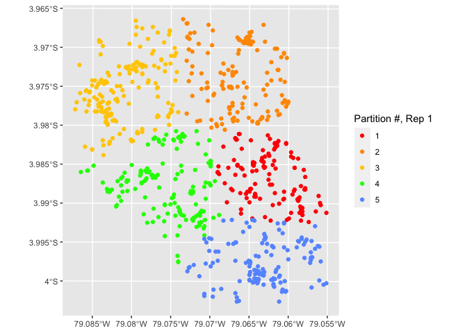
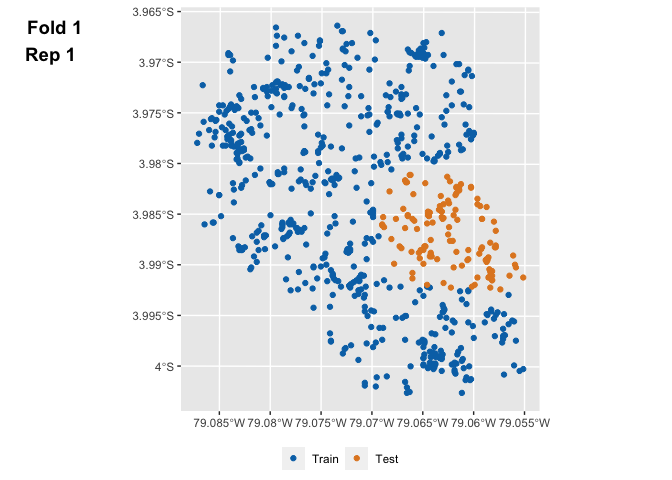

mlr3spatiotempcv
================

Spatio-temporal resampling methods for mlr3.

<!-- badges: start -->

<!-- badges: end -->

This package extends the [mlr3](https://github.com/mlr-org/mlr3) package
framework with spatiotemporal resampling and visualization methods.

⚠️⚠️⚠️  
The package is in very early stages and breaking changes withour further
notice are expected. If you want to use if for your research, you might
need to refactor your analysis along the way.  
⚠️⚠️⚠️

Resampling methods
------------------

Currently, the following ones are implemented:

| Literature                  | Package    | Reference     | mlr3 Sugar                     |
|-----------------------------|------------|---------------|--------------------------------|
| Spatial Buffering           | blockCV    | Valavi 2019   | `rsmp("spcv-buffer")`          |
| Spatial Blocking            | blockCV    | Valavi 2019   | `rsmp("spcv-block")`           |
| Spatial CV                  | sperrorest | Brenning 2012 | `rsmp("spcv-coords")`          |
| Environmental Blocking      | blockCV    | Valavi 2019   | `rsmp("spcv-env")`             |
| \-                          | \-         | \-            | `rsmp("sptcv-cluto")`          |
| Leave-Location-and-Time-Out | CAST       | Meyer 2018    | `rsmp("sptcv-cast")`           |
| —                           | —          | —             | —                              |
| Repeated Spatial Blocking   | blockCV    | Valavi 2019   | `rsmp("repeated-spcv-block")`  |
| Repeated Spatial CV         | sperrorest | Brenning 2012 | `rsmp("repeated-spcv-coords")` |
| Repeated Env Blocking       | blockCV    | Valavi 2019   | `rsmp("repeated-spcv-env")`    |
| \-                          | \-         | \-            | `rsmp("repeated-sptcv-cluto")` |

Spatial tasks
-------------

| Name     | Code              | Type    |
|----------|-------------------|---------|
| ecuador  | `tsk("ecuador")`  | Classif |
| diplodia | `tsk("diplodia")` | Classif |

Spatiotemporal tasks
--------------------

| Name     | Code              | Type |
|----------|-------------------|------|
| cookfarm | `tsk("cookfarm")` | Regr |

Visualization
-------------

Generic S3 function `autoplot()` for all implemented spatial resampling
methods.

### Visualization of all folds

    library(mlr3)
    library(mlr3spatiotempcv)
    library(ggplot2)

    task = tsk("ecuador")
    resampling = rsmp("spcv-coords", folds = 5)
    resampling$instantiate(task)

    autoplot(resampling, task)

<!-- -->

### Visualization of a specific fold

    autoplot(resampling, task, fold_id = 1)

<!-- -->

### Spatiotemporal Visualization

Three-dimensional visualization via {plotly}

(See vignette [“Spatiotemporal
Visualization”](https://mlr3spatiotempcv.mlr-org.com/articles/spatiotemp-viz.html)
for an interactive 3D HTML variant.)

    library(plotly)
    task_st = tsk("cookfarm")
    resampling = rsmp("spcv-cluto", folds = 5)
    resampling$instantiate(task_st, time_var = "Date")
    autoplot(resampling, task_st, fold_id = 1, point_size = 3)

More resources
--------------

For detailed information on how to use spatial resampling in {mlr3}
please read the section about [spatial analysis in the mlr3
book](https://mlr3book.mlr-org.com/spatial.html) and consult the
[Getting
Started](https://mlr3spatiotempcv.mlr-org.com/articles/mlr3spatiotempcv.html)
vignette.

References
==========

Brenning, Alexander. 2012. “Spatial cross-validation and bootstrap for
the assessment of prediction rules in remote sensing: The R package
sperrorest.” In *2012 IEEE International Geoscience and Remote Sensing
Symposium*. IEEE. <https://doi.org/10.1109/igarss.2012.6352393>.

Schratz, Patrick, Jannes Muenchow, Eugenia Iturritxa, Jakob Richter, and
Alexander Brenning. 2019. “Hyperparameter Tuning and Performance
Assessment of Statistical and Machine-Learning Algorithms Using Spatial
Data.” *Ecological Modelling* 406 (August): 109–20.
<https://doi.org/10.1016/j.ecolmodel.2019.06.002>.

Valavi, Roozbeh, Jane Elith, Jose J. Lahoz-Monfort, and Gurutzeta
Guillera-Arroita. 2018. “blockCV: an R package for generating spatially
or environmentally separated folds for k-fold cross-validation of
species distribution models.” *bioRxiv*, June.
<https://doi.org/10.1101/357798>.

