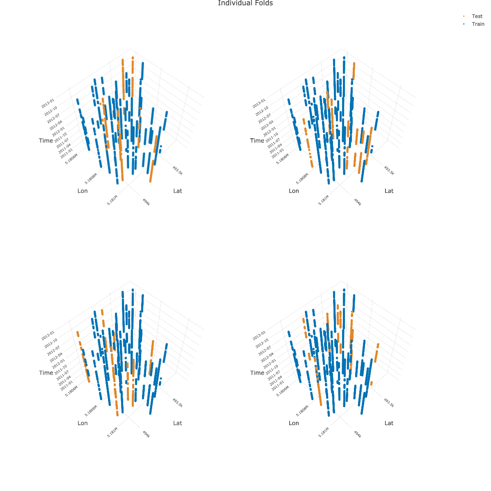
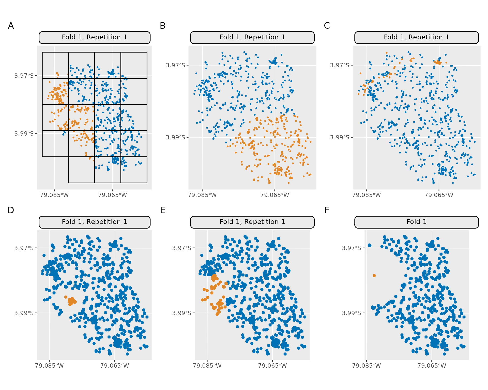

# Spatiotemporal Visualization

## 3D Visualization (spatiotemporal)

{mlr3spatiotempcv} makes use of {plotly} to create the 3D plots for
visualizing spatiotemporal folds. Arranging multiple 3D plots in
{plotly} is done via [3D subplots](https://plotly.com/r/3d-subplots/).

Unfortunately, {plotly}’s subplot implementation is not dynamic. This
means that multiple “scene” objects need to be specified in
`plotly::layout()` to determine the coordinates of the respective
subplot. Depending on the number of chosen folds by the user in
[`autoplot()`](https://mlr3spatiotempcv.mlr-org.com/reference/autoplot.md),
a different number of scenes with different coordinates needs to be
given to align the plots properly.

Hence, manual action is needed to create a properly aligned grid of 3D
plots.

Below is an example how to create a 2x2 grid showing four folds as 3D
subplots. It makes use of the returned 3D plotly objects which are
returned in a list by
[`autoplot()`](https://mlr3spatiotempcv.mlr-org.com/reference/autoplot.md):

``` r
library(mlr3)
library(mlr3spatiotempcv)
task_st = tsk("cookfarm_mlr3")
task_st$set_col_roles("SOURCEID", roles = "space")
task_st$set_col_roles("Date", roles = "time")
resampling = rsmp("sptcv_cstf", folds = 5)

pl = autoplot(resampling, task_st, c(1, 2, 3, 4),
  crs = 4326, point_size = 3, axis_label_fontsize = 10,
  plot3D = TRUE
)

# Warnings can be ignored
pl_subplot = plotly::subplot(pl)

plotly::layout(pl_subplot,
  title = "Individual Folds",
  scene = list(
    domain = list(x = c(0, 0.5), y = c(0.5, 1)),
    aspectmode = "cube",
    camera = list(eye = list(z = 2.5))
  ),
  scene2 = list(
    domain = list(x = c(0.5, 1), y = c(0.5, 1)),
    aspectmode = "cube",
    camera = list(eye = list(z = 2.5))
  ),
  scene3 = list(
    domain = list(x = c(0, 0.5), y = c(0, 0.5)),
    aspectmode = "cube",
    camera = list(eye = list(z = 2.5))
  ),
  scene4 = list(
    domain = list(x = c(0.5, 1), y = c(0, 0.5)),
    aspectmode = "cube",
    camera = list(eye = list(z = 2.5))
  )
)
```



Note: The image shown above is a static version created with
[`plotly::save_image()`](https://rdrr.io/pkg/plotly/man/save_image.html).

Unfortunately, titles in subplots cannot be created dynamically.
However, there is a manual workaround via
[annotations](https://plotly.com/r/reference/#layout-annotations) show
in this [RPubs post](https://rpubs.com/bcd/subplot-titles).

## Examples of spatial partitioning (2D)

The following plots are based on a three fold partitioning of the
[ecuador](https://mlr3spatiotempcv.mlr-org.com/reference/mlr_tasks_ecuador.html)
example task. Method `mlr_resampling_sptcv_cstf` is omitted here as the
`ecuador` task does not have a factor grouping variable which is
required by this method. The partitions created on this dataset do not
claim to necessarily make sense in practice - they should only contrast
the individual methods against each other. The source code can be found
[here](https://github.com/mlr-org/mlr3spatiotempcv/blob/main/vignettes/spatiotemp-viz.Rmd).



| Identifier | Method Name                  |
|:-----------|:-----------------------------|
| A          | `mlr_resampling_spcv_block`  |
| B          | `mlr_resampling_spcv_coords` |
| C          | `mlr_resampling_spcv_env`    |
| D          | `mlr_resampling_spcv_disc`   |
| E          | `mlr_resampling_spcv_tiles`  |
| F          | `mlr_resampling_spcv_buffer` |
