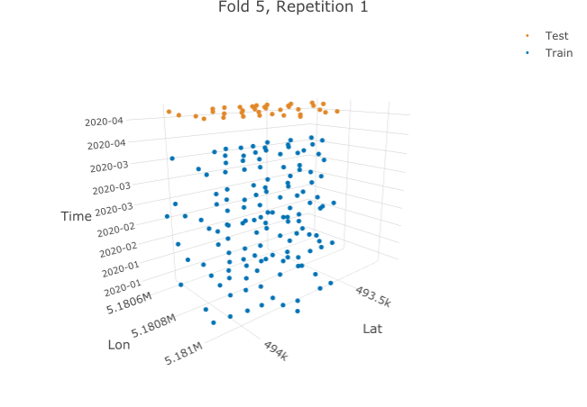
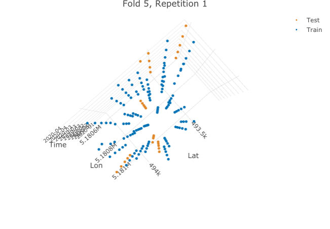
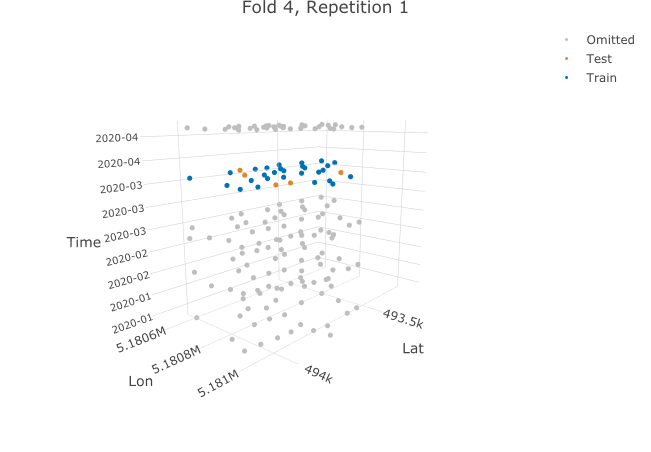

```{r setup, echo=FALSE, purl=FALSE}
# important for correct figure placement
# see https://stackoverflow.com/a/49395389/4185785
knitr::knit_hooks$set(plot = function(x, options) {
  knitr::hook_plot_tex(x, options)
})
```

```{r setup-2, echo=FALSE, purl=T}
# for knitr spin later
knitr::opts_chunk$set(fig.path = "./paper/figs/",
  cache = T,
  cache.lazy = TRUE)
```

# Introduction

Spatial and spatiotemporal prediction tasks are common in applications ranging from environmental sciences to archaeology and epidemiology.
While sophisticated mathematical frameworks have long been developed in spatial statistics to characterize predictive uncertainties under well-defined mathematical assumptions such as intrinsic stationarity (e.g., @cressie1993), computational estimation procedures have only been proposed more recently to assess predictive performances of spatial and spatiotemporal prediction models [@brenning2005; @brenning2012; @pohjankukka2017; @roberts2017].

Although alternatives such as the bootstrap exist and have some advantages [@efron1983; @hand1997], cross-validation is a particularly well-established, easy-to-implement algorithm for *model assessment* of supervised machine learning models (@efron1983 and next section) and *model selection* [@arlot2010].
In its basic form, it is based on resampling the data without paying attention to any possible dependence structure, which may arise from, e.g., grouped or structured data [@brenning2008; @pena2015], or underlying environmental processes inducing some sort of spatial coherence at the landscape scale [@brenning2005].
In treating dependent observations as independent, or ignoring autocorrelation, cross-validation test samples may in fact be heavily correlated with, or even pseudo-replicates of, the data used for training the model, which introduces a potentially severe bias, especially for flexible machine learning models [@brenning2005].

This cross-validation bias is well-known in spatial as well as non-spatial prediction [@brenning2005; @brenning2008; @arlot2010; @roberts2017] and in forecasting [@bergmeir2018].
It is most easily understood from a predictive modelling perspective by focusing on the question where (and when) the model should be used for prediction.
In crop classification from remotely-sensed data, for instance, learning samples routinely contain multiple grid cells from a sample of fields with known crop type, for instance 2000 grid cells from 100 fields scattered across a large study region.
The purpose of training a model on this sample is to make predictions on other, new fields within the same geographic domain (*intra-domain* prediction; @brenning2005) --- not *within* the same field, which obviously presents only one crop type.
In this situation it would therefore seem rather unwise to train a model on a simple random subsample of grid cells, and test it on the remaining data, i.e. using other grid cells from the same fields, as if we wanted to predict within a field.
The results from this performance assessment would be over-optimistic, and perhaps badly so.
To mimic the predictive situation for which the model is trained, one would rather have to resample at the level of fields, not grid cells [@pena2015].
If the model was to be applied to adjacent agricultural districts, i.e. outside the learning sample's spatial domain (*extra-domain* prediction; @brenning2005), it would even seem necessary to resample at a higher level of spatial aggregation, i.e. at the level of agricultural districts within the learning sample, in order to realistically mimic the actual prediction task.
The cross-validation resampling needed therefore depends as much on the prediction task as on the data structure or dependency at hand.

While it is not the purpose of this article to recommend specific resampling schemes for specific use cases, this example may suffice to motivate the use of spatial and spatiotemporal cross-validation techniques, and the need for a unified framework and computational toolbox that accommodate a variety of prediction tasks that may be applicable to a broad range of application scenarios.
\pkg{mlr3spatiotempcv} is such a toolbox.

This toolbox, implemented as an open-source R package, builds upon and generalizes several existing toolboxes that have been developed in recent years for more specific settings (see Table \@ref(tab:sptcv-methods)).
The earliest and most comprehensive of these implementations is the \pkg{sperrorest} R package [@brenning2012], which provides an extensible framework and includes predefined resampling strategies based on, for example, blocking, grouping and buffering.
In contrast, \pkg{blockCV} and \pkg{ENMeval} were developed for block and buffer resampling with a focus on species distribution modelling [@blockCV; @rest2014; @muscarella2014].
Neither of these however have been integrated into established machine learning frameworks such as \pkg{mlr}/\pkg{mlr3} or \pkg{caret}/\pkg{tidymodels}, and all of them lack support of temporal prediction tasks.
The \pkg{CAST} package, in contrast, focuses on spatiotemporal prediction tasks and makes use of some functions of the \pkg{caret} framework [@cast; @meyer2018].
One limitation of these packages is the sole focus on model assessment, while the proposed implementation within the \pkg{mlr3} framework offers a seamless integration into model selection.
It is worth noting that a spatial cross-validation library named \pkg{spacv} has also recently been developed for Python3, which can be used with the \pkg{scikit-learn} machine learning framework [@pedregosa2011].

Thus, \pkg{mlr3spatiotempcv} implements for the first time a comprehensive state-of-the-art compilation of spatial and spatiotemporal partitioning schemes that is well-integrated into a comprehensive machine learning framework in R, the \pkg{mlr3} ecosystem [@mlr3].
This package is furthermore equipped with a variety of two- and three-dimensional visualization capabilities.
Our hope is that this implementation will facilitate reproducible geospatial modeling and code-sharing across a broad range of application domains.

The purpose of this paper is to give an overview of the methods implemented in the R package \pkg{mlr3spatiotempcv}.
After presenting the conceptual background in the following section, the overall structure of the \pkg{mlr3spatiotempcv} package is outlined.
Next, various spatial and spatiotemporal partitioning techniques are contrasted and compared, before their application is demonstrated in a machine learning model assessment in the following section.
Finally, limitations of existing methods are discussed and an outlook is given.

# Spatial and spatiotemporal cross-validation

In cross-validation for predictive model assessment, we consider the following formal setting.
We are interested in predicting a numerical or categorical response $y$ of an object or instance using a feature vector $\mathbf{x} = (x^{(1)}, \ldots, x^{(p)})\in\mathbb{R}^p$ and a model $\hat{f}_\mathcal{L}$ that has been trained on a learning sample $\mathcal{L} = \{(y_i, \mathbf{x}_i),\ i = 1, ..., n\}$.
Our goal is to estimate the expected value of the performance of $\hat{f}_\mathcal{L}$,
\[
\mathit{perf(\hat{f}_\mathcal{L})} := E(l(Y,\hat{f}_\mathcal{L}(X))),
\]
where $l$ is a real-valued loss function, and the expected value is with respect the probability distribution of $X$, the features of an instance $(Y,X)$ drawn randomly from the underlying population.
This is referred to as the *actual* or *conditional* performance measure as it is conditional on $L$ [@hand1997].
The loss function can take a variety of forms such as the misclassification error $I(Y\neq\hat{f}_\mathcal{L}(X))$ in classification, or the squared error $(Y-\hat{f}_\mathcal{L}(X))^2$ in regression, among many other possible measures.
The choice of the performance measure is equally critical as the choice of the estimation procedure, but it is beyond the scope of this contribution to discuss performance metrics for regression and classification (see e.g., @hand1997 for classification, and @hyndman2006 for regression and forecasting tasks).

Since we only have a sample $\mathcal{T}$ of test data drawn from the population, we can only *estimate* the conditional performance of $\hat{f}_\mathcal{L}$:
\[
\widehat{\mathit{perf}}_T(\hat{f}_\mathcal{L}) = \frac{1}{|\mathcal{T}|}\sum_{i=1}^{|\mathcal{T}|}l(Y,\hat{f}_\mathcal{L}(X)).
\]
This representation as a point estimator of $\mathit{perf(\hat{f}_\mathcal{L})}$ underlines the importance of using a random sample for model assessment to avoid estimation bias. Other estimators than the simple mean may be required when $\mathcal{T}$ is not a simple random sample, for instance a stratified random sample [e.g., @thompson2012].
As always, judgment sampling may lead to uncontrollable bias.

Since re-using the learning sample $\mathcal{L}$ for testing, i.e. $\mathcal{T}=\mathcal{L}$, would result in the over-optimistic *resubstitution* or *apparent* performance, cross-validation partitions the sample $\mathcal{L}$ into disjoint training and test sets.
Specifically, $\mathcal{L}$ is split into $k$ partitions,
\[
\mathcal{L} = \mathcal{L}_1 \cup \ldots \cup \mathcal{L}_k,\qquad \mathcal{L}_i\cap \mathcal{L}_j = \emptyset\quad \textrm{for all}\ i\neq j,
\]
and a model $\hat{f}_{(i)}$ is fitted on $\mathcal{L}_{(i)} := \mathcal{L}\setminus \mathcal{L}_i$, while $\mathcal{L}_i$ is withheld for testing.
This is repeated for $i=1,\ldots,k$ in order to effectively use the entire sample for testing, while keeping training and test sets disjoint at all times.
The $k$-fold CV estimator can therefore be written as
\[
\widehat{\mathit{perf}}_{\mathcal{L}, CV}(f) := \frac{1}{k}\sum_{i=1}^k\widehat{\mathit{perf}}_{\mathcal{L}_i}(\hat{f}_{\mathcal{L}_{(i)}}),
\]
where $f$ is a machine learning algorithm, i.e. a mapping that trains a model $\hat{f}_\mathcal{S}$ using any suitable training sample $\mathcal{S}$.
The use of $k=5$ or $k=10$ folds is most commonly seen in practice, and these preferences are also supported by theory [@bengio2004, @cawley2010].
The $k$-fold CV estimator of model performance is a nearly unbiased estimator of the conditional performance measure when the observations were drawn independently [@efron1983].
Since $\widehat{\mathit{perf}}_{\mathcal{L}, CV}(f)$ still depends on the particular partitioning chosen for $L$, it is sometimes recommended to repeat the estimation using different random partitionings ($r$-repeated $k$-fold cross-validation) to reduce the influence of randomness when creating partitions [@vanwinckelen2012].

In traditional cross-validation, the partitioning is based on uniform random sampling, which ignores spatial or temporal autocorrelation or any existing grouping structure as well as the structure of the prediction task, as outlined in section \@ref(introduction), and may result in over-optimistic performance estimates.
Several approaches have therefore been proposed in the literature and implemented in software to accommodate a variety of predictive situations (Table \@ref(tab:sptcv-methods)).

Approaches based on spatial blocking or grouping require either the construction of spatial zones, or the use of pre-existing spatial structures in the data.
Let's refer to these spatial units or zones as $\mathcal{Z_i}$, $1\le i\le n_z$.
These zones are often constructed to serve as the $k=n_z$ spatial partitions, for example by performing $k$-means clustering of the sample coordinates [@russ2010] or generating the desired number of rectangular blocks.
Similarly, the data can be partitioned in feature space instead of geographic space, which has been referred to as environmental blocking [@roberts2017].

When $n_z$ is much larger than the desired number of folds, $k$, then a partitioning can be applied to the zones themselves. In this case, the zone indices $1, \ldots, n_z$ are grouped into $k$ equally sized subsets $\mathcal{I}_1, \ldots, \mathcal{I}_k$.
This approach has been applied, for example, in spatial CV at the agricultural field level [@pena2015].
In the following we will conceptually distinguish between CV *at the group (or block) level*, referring to the latter scenario, from spatial *block (or grouped)* CV, where the blocks or groups themselves define the CV partitions.

A variant of cross-validation is leave-one-out (LOO) cross-validation, which has long been established in geostatistics [@cressie1993], sometimes with a focus on the spatial distribution of LOO error [@willmott2006].
Although this is just a special case of non-spatial CV with $k=n$, it is sometimes also referred to as spatial CV [@willmott2006].
Nevertheless, spatial variants have been proposed that apply an exclusion buffer to the test locations to separate them from the training data [@brenning2005].
One plausible approach for this is to use the range of autocorrelation of model residuals to determine the buffer distance as this ensures independence conditional on the predictors [@brenning2005].
When data is grouped, e.g., due to multi-level sampling designs or the study of spatial objects, it has been proposed to apply LOO at the site level [@martin2008; @kasurak2011] or, in animal movement studies, at the animal level [@anderson2005]; we will refer to this as leave-location-out (LLO) CV.

It should be noted that $k$-fold cross-validation with a large value of $k$, and LOO-CV in particular ($k=n$), is not only very time-consuming since the model has to be trained $k$ times; these models will also be nearly identical since only a tiny fraction of the data is withheld, and therefore estimation bias increases.
'Pure' LOO-CV is therefore not recommended for machine learning model assessment.

In the purely temporal domain, a special case is to leave out temporal observational units (or time slices; leave-time-out or LTO CV), as in leave-one-year-out CV [@anderson2005; @brenning2005].
Cross-validation and hold-out validation strategies for time series have been discussed more extensively in the forecasting literature, considering also the effects of serial autocorrelation [@bergmeir2018].

Turning to prediction tasks with spatiotemporal data, various spatial, temporal, or spatiotemporal partitioning strategies are being used, depending on the specific study objectives.
While the former two ignore the spatial and temporal dimension of the data, respectively, it has also been proposed to leave out spatiotemporal blocks [@meyer2018] or clusters [@cluto].


# mlr3spatiotempcv within the mlr3 ecosystem

With the increased awareness of the importance of spatial and spatiotemporal resampling strategies and the growing popularity of R in environmental modeling and geocomputation, it is important to equip machine learning frameworks such as \pkg{mlr3} with suitable algorithms.
In this context, the \pkg{mlr3} ecosystem stands out as a unified, object-oriented and extendable framework designed to accommodate numerous machine learning tasks with a variety of learners, feature and model selection tools, and model assessment capabilities [@mlr3; @mlr3book].
All of these are supported by advanced visualization tools, which are particularly important in a spatial and spatiotemporal setting.

With its integrative approach and its aim to provide long-term support, \pkg{mlr3} overcomes the challenges of combining multiple specialized packages with poorly standardized interfaces.
Issues that practitioners often face include varying argument lists of learners, different return values of `predict` methods, and support for only specific feature types.
These challenges result in substantial overhead and possible reproducibility issues, which are exacerbated by asynchronous development timelines of different components of the machine learning pipelines.

Within the \pkg{mlr3} ecosystem, partitioning strategies are represented by their own objects of class \texttt{Resampling}, most of which are available within \pkg{mlr3} itself (e.g., regular random CV); other specialized strategies (e.g., \texttt{TaskClassifST} or \texttt{TaskRegrST}) are defined in extension packages such as \pkg{mlr3spatiotempcv}.
In the machine learning pipeline, these objects define the data splits used for model evaluation and selection (hyperparameter tuning) by machine learning algorithms.
Spatial and spatiotemporal partitioning techniques in \pkg{mlr3spatiotempcv} are currently mostly imported and interfaced from other packages, in particular \pkg{sperrorest}, \pkg{blockCV} and \pkg{CAST} [@blockCV; @brenning2012; @cast], in order to expose them to \pkg{mlr3} functionality.
To reduce first-level dependencies, some methods were re-implemented instead of importing them from upstream packages.

Resampling objects in \pkg{mlr3spatiotmpcv} inherit from class \texttt{mlr3::Resampling} and can be created from established object classes for geospatial data in R, including simple features [@pebesma2018], which facilitates their integration into domain-specific workflows in the geospatial sciences.
Support for projected (planar) and unprojected (geographic) coordinate reference systems (CRS) currently varies depending on the partitioning techniques used, since these inherit their behavior from the underlying upstream R package.
It is planned to provide a more consistent interface that supports all CRS and allows the use of distance measures in projected planar space or using great circle distances on the unprojected ellipsoid, in the case of unprojected CRS.

Partitioning objects in \pkg{mlr3spatiotempcv} are equipped with generic `plot()` and `autoplot()` methods that visualize the created groups.
`autoplot()` is \pkg{ggplot2}-based and uses [ggplot2](https://ggplot2.tidyverse.org) [@ggplot2] in two-dimensional geographic space and [plotly](https://github.com/ropensci/plotly) [@plotly] in three dimensions, i.e. geographic space plus time.

While \pkg{mlr3spatiotempcv} solely focuses on spatiotemporal resampling methods and their visualization, other packages such as \pkg{mlr3spatial} or \pkg{mlr3temporal} are planned in the mlr3 ecosystem to provide dedicated spatiotemporal learner and prediction methods.

# Spatiotemporal partitioning methods

\pkg{mlr3spatiotempcv} currently implements the partitioning methods identified in Table \@ref(tab:sptcv-methods) with their \pkg{mlr3} class name.
Several of the implemented algorithms are themselves versatile toolboxes with multiple options.
Comprehensive and up-to-date information can be found in the package's online documentation (<https://mlr3spatiotempcv.mlr-org.com>).
The following sections, which follow the naming scheme `<method name> --- <R package>`, give an overview of most existing partitioning strategies and their visualization options.
The available methods are further discussed in section \@ref(sec:disc).

\begin{table}[h]
  \centering
  \footnotesize
  \caption[t]{Spatiotemporal resampling methods, ordered alphabetically by class name (column 'mlr3 Notation'). Column count refers to the number of studies which were found to have used this resampling technique until 2021-05.}
  \begingroup
    \begin{tabular}{lllll}
      \\
      Type                            & Name                        & R Package(s)     & mlr3 Notation  & Count\\
      \toprule
      \multirow{6}{*}{Spatial}        & Spatial Buffering           & \specialcell{\pkg{blockCV} \\ \pkg{sperrorest}}    & \specialcell{ \texttt{"spcv\_buffer"} \tablefootnote{\label{ploton2020}\cite{ploton2020}}  \tablefootnote{\label{diesing2020}\cite{diesing2020}} \\  \texttt{"spcv\_disc"} \tablefootnote{\label{endicott2017}\cite{endicott2017}} \tablefootnote{\label{karasiak2021}\cite{karasiak2021}} \tablefootnote{\label{moller2021}\cite{moller2021}}}  & \specialcell{2 \\ 3}   \\
      \cmidrule{2-5}
                                      & Spatial Blocking            & \specialcell{\pkg{blockCV}  \\ \pkg{sperrorest}}  & \specialcell{  \texttt{"spcv\_block"} \tablefootnote{\label{jensen2021}\cite{jensen2021}} \tablefootnote{\label{escobar2021}\cite{escobar2021}} \tablefootnote{\label{stewart2021}\cite{stewart2021}} \\  \texttt{"spcv\_tiles"} \tablefootnote{\label{bebber2017}\cite{bebber2017}} \tablefootnote{\label{brenning2015}\cite{brenning2015}} \tablefootnote{\label{zurell2020}\cite{zurell2020}} }
                                        & \specialcell{28 \\ 4} \\
  \cmidrule{2-5}
                                      & Spatial Clustering          & \pkg{sperrorest} & \texttt{"spcv\_coords"} \tablefootnote{\label{morera2021}\cite{morera2021}} \tablefootnote{\label{geiss2017}\cite{geiss2017}} \tablefootnote{\label{wu2020}\cite{wu2020}} &  21 \\
                                      \cmidrule{2-5}
       & Group-Level CV & \specialcell{\pkg{CAST} \\ \pkg{mlr3}}       & \specialcell{ \texttt{"sptcv\_cstf"} (LLO) \tablefootnote{\label{blothe2021}\cite{blothe2021}} \tablefootnote{\label{dolan2021}\cite{dolan2021}} \tablefootnote{\label{dumke2019}\cite{dumke2019}}  \\ \texttt{"custom\_cv"} \tablefootnote{\label{brenning2006}\cite{brenning2006}} \tablefootnote{\label{pena2015}\cite{pena2015}}} & \specialcell{12 \\ 2}       \\
      \midrule
      \multirow{2}{*}{Spatiotemporal} & Leave-Location-and-Time-Out & \pkg{CAST}       &  \texttt{"sptcv\_cstf"} \tablefootnote{\label{egli2020}\cite{egli2020}} \tablefootnote{\label{gao2019}\cite{gao2019}} \tablefootnote{\label{reitz2021}\cite{reitz2021}} & 6 \\
                                      & Spatiotemporal Clustering   & \pkg{skmeans}    &  \texttt{"sptcv\_cluto"} &  -  \\
      \midrule
      Feature space                   & Environmental Blocking      & \pkg{blockCV}    &  \texttt{"spcv\_env"} \footref{morera2021}   & 1    \\

    \end{tabular}
  \endgroup\label{tab:sptcv-methods}
\end{table}


## Spatial

Spatial partitioning methods operate in a two-dimensional space and split observations into training and test set by their spatial location.
Methods such as grid-based partitioning or clustering are used to create groups of observations which may then be aggregated further to form the final partition sets.

Spatial partitioning methods can be roughly divided into three groups: (1) buffering, (2) blocking and (3) clustering methods (Table \@ref(tab:sptcv-methods)).
If a method could have been placed into multiple categories, we deliberately assigned the group which matched best the main characteristic of the respective method.

### Buffering

"Buffering" refers to the idea of removing observations between test and training set by drawing a circular buffer around one or more observations [@rest2014, @brenning2012, @blockCV].
Within this buffer zone, all observations are removed from the training set, thereby reducing the similarity between training and test set.

<!--JM: not entirely sure what scattered appearance refers to-->
Buffering is most often applied in coordinate space due to the scattered appearance of observations in this space.
However, this method could be easily extended to a 2D + time setting.
<!-- JM: I guess you mean that you could have placed buffering also into spatiotemporal partition. I would advise to say so instead of letting the reader guess.-->
Since \pkg{mlr3spatiotempcv} supports two spatial-only "buffering" implementations, (1) "Spatial buffering" from package \pkg{blockCV} and (2) "Leave-one-disc-out cross-validation" from \pkg{sperrorest}, buffering was attributed to the category of spatial partitioning methods (see Table \@ref(tab:sptcv-methods)). 

#### Spatial buffering --- blockCV

The "buffering" method from the \pkg{blockCV} package is conceptually similar to a leave-one-out (LOO) cross-validation approach [@stone1974].
It comes with optional support for presence/absence data handling, as often used in the field of species distribution modeling (SDM) [@hijmans2013].
However, by default, the method considers all points for sampling the training and test sets.

In an ecological/species distribution modeling context, the default assumption of a binary response variable is to have *presence/absence* data.
This means all presence and absence values in the response variable are confirmed in their respective status.
The \pkg{blockCV} package implementation also comes with support for *presence/background* data for binary responses.

All other response observations are assumed to be absent without a proof for this assumption.
When setting argument `spDataType = "PB"`, the method only considers the *presence* observations in a CV scenario.
Background data is used for training the model by default unless argument `addBG = FALSE` is set for which only *presence* values not falling within the buffer zone of the respective fold are used for model training.

Due to its similarity to a LOO CV, this method will result in as many train/test evaluations as observations are present.
In the visualization of the first fold in Fig. \@ref(fig:buffer) a buffer zone of 1000 m was used without any custom presence/absence treatment of the data.

```{r buffer, fig.cap="Visualization of the 'Spatial buffering' method from package `blockCV`.", out.width="40%", fig.pos="ht"}
library("mlr3")
library("mlr3spatiotempcv")
task = tsk("ecuador")
resampling_buffer = rsmp("spcv_buffer", theRange = 1000)
resampling_buffer$instantiate(task)

autoplot(resampling_buffer,
  size = 0.8, task = task, fold_id = 1) *
  ggplot2::scale_y_continuous(breaks = seq(-3.97, -4, -0.01)) *
  ggplot2::scale_x_continuous(breaks = seq(-79.06, -79.08, -0.01))
```

<!-- TODO: Discuss issues setting a sensible range value -->

#### Leave-one-disc-out --- sperrorest

Another buffering oriented resampling method is "Leave-one-disc-out" from package \pkg{sperrorest}.
The name originates from the generic "Leave-one-out" method.
The 'disc' part in the name here refers to the radial area/buffer zone around the test set which is (optionally) being left out within each fold.

In addition, one can specify to sample with replacement by setting `replace = TRUE`.

The method starts from a randomly selected observation and adds all points within the buffer zone area set via variable `radius` by the user.

Around the radial test set a buffer zone / neutral area can be defined via variable `buffer` in which observations are excluded from the training set, increasing the spatial distance between training and test sets.

```{r disc, fig.cap="Visualization of 'Leave-one-disc-out' method.", out.width="40%"}
resampling_disc = rsmp("spcv_disc", folds = 5, radius = 300L, buffer = 400L)
resampling_disc$instantiate(task)

autoplot(resampling_disc,
  size = 0.8, task = task, fold_id = 1) *
  ggplot2::scale_y_continuous(breaks = seq(-3.97, -4, -0.01)) *
  ggplot2::scale_x_continuous(breaks = seq(-79.06, -79.08, -0.01))
```

### Blocking

"Spatial Blocking" creates homogeneous blocks across the study area splitting observations into different zones [@bahn2012, @wenger2012, @blockCV].
The creation of these zones can be diverse: one option is to supply rows and columns to subdivide the data into a grid.
Others make use of landscape patterns such as crop zones [@russ2010] or species presence [@blockCV] to determine an initial partitioning.

Implementations of blocking methods often provide additional options to fine tune these initial partitions, allowing for fine-grained partition creation.

\pkg{mlr3spatiotempcv} supports two "blocking" implementations: (1) "Spatial blocking" from package \pkg{blockCV} and (2) "Spatial Tiles" from \pkg{sperrorest}.

#### Spatial blocking --- blockCV

The "Spatial blocking" from package \pkg{blockCV} comes with various blocking options such as random (default) (`selection = "random"`), systematic (`selection = "systematic"`) or checkerboard pattern (`selection = "checkerboard"`).
Additionally, the user might supply a numeric value in meters via argument `theRange` (named just `range` in {mlr3spatiotempcv}) which will ensure a quadratic block pattern across the study area.
<!--JM: to stay consistent please add the argument which lets the user indicate a user-defined polygon or are you referring to the rectangular block design specified with rows and cols? If so, say so. If not, clarify and additionally mention the rectangular block design here-->
This kind of blocking might be of special interest for SDM studies as well as the possibility to supply a user-defined polygon with predefined blocking zones.

After the initial block creation, multiple "blocks" are combined to form a partition in correspondence with the number of folds requested by the user.
For example, in a five-fold scenario with a grid of four columns and five rows, the method would combine one fifth of all blocks (= four blocks) into a single partition.

The following subsections showcase some of the introduced options.

##### Option: selection = "random"

```{r block-random, fig.cap="Spatial blocking with option `selection = 'random'`.", out.width="40%", fig.pos="ht"}
resampling_block_random = rsmp("spcv_block", range = 1000, folds = 5)

autoplot(resampling_block_random,
  size = 0.8, fold_id = 1, task = task,
  show_blocks = TRUE, show_labels = TRUE) *
  ggplot2::scale_y_continuous(breaks = seq(-3.97, -4, -0.01)) *
  ggplot2::scale_x_continuous(breaks = seq(-79.06, -79.08, -0.01))
```

##### Option: selection = "systematic"

Here, aggregation follows the linear count from $1:n_{folds}$ from top to bottom.

```{r block-systematic, fig.cap="Spatial blocking with option `selection = 'systematic'`.", out.width="40%", fig.pos="ht"}
resampling_block_systematic = rsmp("spcv_block",
  range = 1000, folds = 5,
  selection = "systematic"
)

autoplot(resampling_block_systematic,
  size = 0.8, fold_id = 1, task = task,
  show_blocks = TRUE, show_labels = TRUE) *
  ggplot2::scale_y_continuous(breaks = seq(-3.97, -4, -0.01)) *
  ggplot2::scale_x_continuous(breaks = seq(-79.06, -79.08, -0.01))
```

##### Option: selection = "checkerboard"

This option ignores parameter `range` and always creates two partitions following a "1,2,1,2" pattern.

```{r block-checkerboard, fig.cap="Spatial blocking with option `selection = 'checkerboard'`.", out.width="40%", fig.pos="ht!"}
resampling_block_checkerboard = rsmp("spcv_block",
  range = 1000, folds = 5,
  selection = "checkerboard")

autoplot(resampling_block_checkerboard,
  size = 0.8, fold_id = 1, task = task,
  show_blocks = TRUE, show_labels = TRUE) *
  ggplot2::scale_y_continuous(breaks = seq(-3.97, -4, -0.01)) *
  ggplot2::scale_x_continuous(breaks = seq(-79.06, -79.08, -0.01))
```

\newpage

##### Rectangular blocks

Alternatively, arguments `rows` and `cols` can be specified instead of `theRange`.
This allows to create rectangular blocks which honor the supplied `rows` and `cols` settings.

```{r block-rows-and-cols, fig.cap="Spatial blocking with arguments `rows` and `cols`.", out.width="40%", fig.pos="ht"}
resampling_block_rows_cols = rsmp("spcv_block",
  rows = 6, cols = 3, folds = 5
)

autoplot(resampling_block_rows_cols,
  size = 0.8, fold_id = 1, task = task,
  show_blocks = TRUE, show_labels = TRUE) *
  ggplot2::scale_y_continuous(breaks = seq(-3.97, -4, -0.01)) *
  ggplot2::scale_x_continuous(breaks = seq(-79.06, -79.08, -0.01))
```

\newpage

#### Spatial Tiles --- sperrorest

Method `partition_tiles()` from package \pkg{sperrorest} also uses rectangular blocks to partition the study area.
In contrast to "Spatial Blocking" from \pkg{blockCV} these blocks can be rotated (via argument `rotation`) and a minimum number of observations per block can be set (argument `min_n`).
A predefined row/column grid is required via either argument `dsplit` or `nsplit` and no square blocks can be used.
Small tiles can be merged with adjacent blocks via argument `reassign` or optionally be ignored (`reassign = FALSE`).
The number of tiles set by the user equals the number of folds and blocks cannot be grouped into folds as in "Spatial Blocking".
Also despite setting 12 blocks via `nsplit = c(3L, 4L)` in the following example, the final partition count is eleven because the bottom-left part of the study area does not contain observations.

```{r tile, fig.cap="Spatial tiling with arguments `rows` and `cols`.", out.width="40%", fig.pos="ht"}
resampling_tiles = rsmp("spcv_tiles", nsplit = c(3L, 4L))

autoplot(resampling_tiles,
  size = 0.8, fold_id = 1, task = task) *
  ggplot2::scale_y_continuous(breaks = seq(-3.97, -4, -0.01)) *
  ggplot2::scale_x_continuous(breaks = seq(-79.06, -79.08, -0.01))
```

### Clustering

The idea of cluster analysis, which originated in the 1930s in the field of anthropology [@driver1932, @zubin1938], is to group objects with similar characteristics.
In the spatial context, the similarity of spatial coordinates is used to form such groups.
Different cluster algorithms such as hierarchical, density-based, grid-based or centroid-based clustering exist [@gower1967].

#### Coordinate-based clustering --- sperrorest

The so-called "Spatial CV" method after [@russ2010; @brenning2012] and implemented in package \pkg{sperrorest} uses the coordinates of all observations to create clusters in the spatial domain with the help of the $k$-means clustering algorithm.^[$k$-means clustering belongs to the centroid-based clustering family.]
To avoid confusion with other spatial partitioning methods, we refer to this as coordinate-based clustering, or as `spcv_coords` in \pkg{mlr3spatiotempcv}, instead of using the generic "Spatial CV" term.

This approach is very versatile as it adapts to irregularly-shaped study areas and ensures that exactly $k$ partitions are created.
Nevertheless, despite the random selection of initial cluster centers, repeated partitionings may in some cases be nearly identical.
Also, $k$-means clustering may be less suitable for data sets with existing clusters of points and/or with distant isolated sample locations.

```{r coords, fig.cap="Method 'Spatial CV' showing k-means clustering based on coordinates.", out.width="40%", fig.pos="ht"}
resampling_coords = rsmp("spcv_coords", folds = 5)$instantiate(task)

autoplot(resampling_coords,
  size = 0.8, fold_id = 1, task = task) *
  ggplot2::scale_y_continuous(breaks = seq(-3.97, -4, -0.01)) *
  ggplot2::scale_x_continuous(breaks = seq(-79.06, -79.08, -0.01))
```

## Spatial, temporal or spatiotemporal

Some methods have the ability to operate in multiple spaces, i.e. spatial, temporal or spatiotemporal (2D + time).
To avoid redundancy and putting too much weight on certain methods, only the spatiotemporal examples of these methods will be shown in the following sections.
For the respective other spaces, usually only one of the space or time variable inputs needs to be omitted.

### Group-level resampling

Group-level CV follows the principle of an inherit grouping structure of the observations, both in space and/or time, to determine (groups of) partitions.
In contrast to blocking or clustering not the spatial or temporal location is used but additional metadata such as the membership to a specific crop type [@brenning2006].
The idea to follow an inherited grouping structure of the data is also referred to as "target-oriented validation" [@cast].
Even though flexibility with respect to fold creation is limited due to the inherited grouping structure within the data, some implementations allow to specify the resulting number of folds by omitting parts of the dataset.

\pkg{mlr3spatiotempcv} supports two "grouping" implementations: (1) The "Leave-location-and-time-out" family from package \pkg{CAST} and (2) "Custom Resampling" from the \pkg{mlr3} package.

#### Leave-Location-And-Time-Out --- CAST

Leave-Location-and-Time-Out (LLTO) from package \pkg{CAST} is a spatiotemporal resampling method [@meyer2018].
It requires both a spatial and a temporal variable which are used to separate observations in a multi-dimensional space.
It comes with satellite methods named "Leave-time-out" (LTO) and "Leave-location-out" (LLO) which only operate in a two-dimensional space.

In this example the `cookfarm` dataset is used because it contains the variable ("Date") which serves as the temporal component in the dataset.

Two visualization types are supported by `mlr3spatiotempcv::autoplot()` for this method: a two-dimensional and a three-dimensional one which can be selected via the logical argument `plot3D`.
The 3D visualization (i.e. 2D + time) is done via package \pkg{plotly}.
Because a dynamic image cannot be included in this manuscript, a static version, which can be generated by setting `static_image = TRUE`, is shown.

In \pkg{mlr3spatiotempcv} the method is named `"sptcv_cstf"` which is an acronym originating from the underlying upstream implementation in package \pkg{CAST} `CreateSpacetimeFolds()`.

##### Leave-Time-Out (LTO)

To better showcase the partitioning of the "Leave-Time-Out" (LTO) method, the temporal variable `Date` was adjusted in this example.

The following code uses the `cookfarm` dataset as the base, modifies the `Date` variable in such a way that it contains five unique levels and then creates a spatiotemporal regression task in \pkg{mlr3spatiotempcv} (Fig. \@ref(fig:lto)).

```{r, results='hide'}
data = cookfarm_sample
data$Date = rep(c(
  "2020-01-01", "2020-02-01", "2020-03-01", "2020-04-01",
  "2020-05-01"), times = 1, each = 100)
b = mlr3::as_data_backend(data)
b$hash = "_mlr3_tasks_cookfarm_"
task_spt = TaskRegrST$new(
  id = "cookfarm", b, target = "PHIHOX",
  extra_args = list(
    coordinate_names = c("x", "y"), coords_as_features = FALSE,
    crs = 26911)
)

resampling_cstf_time = rsmp("sptcv_cstf", folds = 5, time_var = "Date")
resampling_cstf_time$instantiate(task_spt)

autoplot(resampling_cstf_time,
  fold_id = 5, task = task_spt, plot3D = TRUE
)
```

```{r lto, echo=FALSE, out.width="70%", fig.cap="Three-dimensional visualization of method `sptcv\\_cstf` and sub-method Leave-Time-Out (LTO). To support showcasing the temporal grouping, five folds and five temporal levels in variable `Date` were used in this example.", fig.pos="ht"}

```

##### Leave-Location-Out (LLO)

Method "Leave-Location-Out" (LLO) works similar to "Leave-Time-Out" (LTO) in that it operates in a two-dimensional space.
Here, specific locations are left out for forming the partitions while the temporal information is ignored (Fig. \@ref(fig:llo)).

```{r results='hide'}
resampling_cstf_loc = rsmp("sptcv_cstf", folds = 5, space_var = "SOURCEID")
resampling_cstf_loc$instantiate(task_spt)

autoplot(resampling_cstf_loc,
  fold_id = 5, task = task_spt, plot3D = TRUE)
```

```{r llo, echo=FALSE, out.width="70%", fig.cap="Three-dimensional visualization of method 'sptcv\\_cstf' and sub-method 'Leave-Location-Out' (LLO). To support showcasing the spatial grouping, the viewing angle has been adjusted to a view from top. Points are stacked by temporal levels and only points from the same location are chosen to form a partition.", fig.pos="ht"}

```

##### Leave-Location-and-Time-Out (LLTO)

The "Leave-Location-and-Time-Out" (LLTO) method combines both "Leave-Time-Out" (LTO) and "Leave-Location-Out" (LLO).
It creates partitions that operate on spatiotemporal clusters to reduce both spatial and temporal autocorrelation.
To achieve this, observations are omitted and only a subset is used.
In the special scenario with five temporal levels and five folds, the train/test split happens only at one temporal level (Fig. \@ref(fig:llto)).

```{r results='hide'}
resampling_cstf_time_loc = rsmp("sptcv_cstf",
  folds = 5,
  space_var = "SOURCEID", time_var = "Date")
resampling_cstf_time_loc$instantiate(task_spt)

autoplot(resampling_cstf_time_loc,
  fold_id = 4, task = task_spt, plot3D = TRUE,
  show_omitted = TRUE)
```

```{r llto, echo=FALSE, out.width="70%", fig.cap="Three-dimensional visualization of method 'sptcv\\_cstf' and sub-method 'Leave-Location-And-Time-Out' (LLTO). The grey points show the points omitted by this method, i.e. the points which are neither used in the training nor test set in this fold.", fig.pos="ht"}

```

### Custom (fixed) Resampling --- mlr3

<!--JM: you might want to delete the FIXME-->
Support for user-defined partitioning strategies is built into \pkg{mlr3} directly since version 0.12.0 FIXME.
Labelled as "Custom CV", users are able to supply an external factor vector with the same length as number of observations.
Each level of the factor vector will result in one partition.
Alternatively to supplying an external factor vector, the name of a feature (type `character`) present within the task can be supplied via argument `col`.

The following example was taken from `sperrorest::partition_factor()` because the resulting partitions separate nicely from each other in a visual way.

```{r custom-cv, fig.cap="Custom resampling using an external factor vector defining the partitions. Each coloring represents one partition.", out.width="40%", fig.pos="ht"}
breaks = quantile(task$data()$dem, seq(0, 1, length = 6))
zclass = cut(task$data()$dem, breaks, include.lowest = TRUE)

resampling_custom = rsmp("custom_cv")
resampling_custom$instantiate(task, f = zclass)

autoplot(resampling_custom, size = 0.8, task = task) *
  ggplot2::scale_y_continuous(breaks = seq(-3.97, -4, -0.01)) *
  ggplot2::scale_x_continuous(breaks = seq(-79.06, -79.08, -0.01))
```

## Feature space clustering

The last method from the \pkg{blockCV} package, "environmental blocking", makes use of *k-means* clustering [@hartigan1979a] in a possibly multivariate space.
<!--JM: pls rewrite next sentence. Do not use levels when you later on say the feature has to be numeric-->
The user can select a variable via argument `features` which specifies which levels will be used to create clusters.
Hereby, k-means will use Euclidean distance for cluster creation.
Hence, the selected input variables should be of type numeric.
To avoid a potential bias introduced by features with high variance when selecting multiple features, all features are standardized by default.

The following example clusters by feature "distance to forest".

```{r env-1, fig.cap="Environmental blocking using a single predictor.", out.width="40%", fig.pos="ht"}
resampling_env = rsmp("spcv_env",
  features = "distdeforest", folds = 5)

autoplot(resampling_env,
  size = 0.8, fold_id = 1, task = task) *
  ggplot2::scale_y_continuous(breaks = seq(-3.97, -4, -0.01)) *
  ggplot2::scale_x_continuous(breaks = seq(-79.06, -79.08, -0.01))
```

It is also possible to cluster by multiple features:

```{r env-2, fig.cap="Environmental blocking using multiple predictors.", out.width="40%", fig.pos="ht"}
resampling_env_multi = rsmp("spcv_env",
  features = c("distdeforest", "slope"), folds = 5)

autoplot(resampling_env_multi,
  size = 0.8, fold_id = 1, task = task) *
  ggplot2::scale_y_continuous(breaks = seq(-3.97, -4, -0.01)) *
  ggplot2::scale_x_continuous(breaks = seq(-79.06, -79.08, -0.01))
```

## Additional partitioning techniques

Considering the wealth and continuing development of spatial and spatiotemporal partitioning techniques for specific applications, we will refrain from providing a complete account of these algorithms.
At present, \pkg{mlr3spatiotempcv} also supports spatiotemporal partitioning using the versatile CLUTO clustering algorithm [@cluto].
CLUTO is available in R through the \pkg{skmeans} package, which provides an interface to a downloadable compiled library with a restriction to non-commercial uses (see `?ResamplingSptCVCluto` in \pkg{mlr3spatiotempcv} for more information).
With respect to functionality, \pkg{mlr3spatiotempcv} supports two-dimensional clustering based on coordinates and three-dimensional clustering on coordinates and time.
<!--JM: not clear why feature clustering is not available when you already have presented the enviromental blocking based on specific features-->
Feature clustering is not supported.

# Case study: Comparing spatial and non-spatial resampling {#sec:case-study}

We will use a well-known case study to demonstrate the application of spatial resampling techniques.
This binary classification task on landslide susceptibility in Ecuador [@muenchow2012] is available as a built-in task via `tsk("ecuador")`.

Because the spatial grouping of the k-means based approach (`"spcv_coords"`) (Fig. \@ref(fig:vis-spcv)) contrasts visually very well to NSpCV (random) partitioning (Fig. \@ref(fig:vis-nspcv)), this method was chosen to showcase the 2D plotting capabilities of \pkg{mlr3spatiotempcv}.

Besides the required arguments of the \pkg{mlr3} superclass `Task`, the `TaskClassifST` / `TaskRegrST` classes from package \pkg{mlr3spatiotempcv}  also require the following arguments during construction which must be passed via a named list `extra_args`:

- `coordinate_names`: Names of the features which represent the spatial coordinates.
  This is automatically inferred when a `sf` object is passed.
- `coords_as_features`: Whether the coordinates should be used as features during modeling.
  By default coordinates are not used as predictors.
- `crs`: The coordinate reference system of the data. Valid inputs are PROJ4 strings or EPSG codes in the format `ESPG:<code>`.

At first all necessary R packages are loaded and a lower verbosity is set to keep the output tidy.
Also a seed is set for deterministic execution and the \pkg{mlr3spatiotempcv} built-in task `"ecuador"` is loaded via `tsk()`.

```{r create-task}
library(mlr3)
library(mlr3spatiotempcv)

# be less verbose
lgr::get_logger("bbotk")$set_threshold("warn")
lgr::get_logger("mlr3")$set_threshold("warn")

set.seed(42)

# equal to `tsk("ecuador")`
b = mlr3::as_data_backend(ecuador)
b$hash = "_mlr3_tasks_ecuador_" # optional
task = TaskClassifST$new(
  id = "ecuador", b, target = "slides", positive = "TRUE",
  extra_args = list(
    coordinate_names = c("x", "y"), coords_as_features = FALSE,
    crs = "EPSG:32717")
)
```

To show the effect of spatial autocorrelation on performance estimates in cross-validation, we will apply spatial and non-spatial cross-validation to the prediction of landslides using the random forest technique (`"classif.ranger"`).
Specifically, we use spatial partitioning based on $k$-means clustering of the coordinates (method `"repeated_spcv_coords"`) and compare its results to a non-spatial (random) cross-validation (`"repeated_cv"`), both with (only) four folds and two repetitions for demonstration.
We choose the area Under the ROC curve (`"classif.auc"`) as the performance measure for this classification task.

## Data preparation

Next, the random forest learner (`lrn("classif.ranger")`) is initialized with default hyperparameters and the prediction type set to `"probability"` due to the binary response variable.
A set of commonly used learners is available in package \pkg{mlr3learners} [@mlr3learners], including the random forest implementation after @ranger.

```{r prepare}
library("mlr3learners")

learner = lrn("classif.ranger", predict_type = "prob")
```

## Non-spatial cross-validation

A four-fold, two times repeated non-spatial resampling object is constructed and instantiated via method `$instantiate()`.
Next, the created resampling object `resampling_nsp` is passed to function `resample()` together with the Task and Learner created earlier to execute the cross-validation.

The results from the CV are then aggregated using the measure `"classif.auc"`, which is the \pkg{mlr3} package notation for the Area Under the Receivers Operating Curve (AUROC) measure.

```{r rr-nspcv, cache.lazy = FALSE}
resampling_nsp = rsmp("repeated_cv", folds = 4, repeats = 2)
resampling_nsp$instantiate(task)
rr_nsp = resample(
  task = task, learner = learner,
  resampling = resampling_nsp
)

rr_nsp$aggregate(measures = msr("classif.auc"))
```

## Spatial cross-validation

The same approach as for non-spatial resampling is used for spatial resampling, expect replacing method `"repeated_cv"` by `"repeated_spcv_coords"`.

```{r rr-spcv, cache.lazy = FALSE}
resampling_sp = rsmp("repeated_spcv_coords", folds = 4, repeats = 2)
resampling_sp$instantiate(task)
rr_sp = resample(
  task = task, learner = learner,
  resampling = resampling_sp
)

rr_sp$aggregate(measures = msr("classif.auc"))
```

## Fold visualization

Finally, we visualize the folds that were used during performance estimation making use of the generic `autoplot()` function in package \pkg{mlr3spatiotempcv}.
Due to space limitations only the first two folds are shown.

```{r vis-spcv, fig.cap="Visualization of spatial partitioning", fig.pos="ht", fig.height=6, fig.width=8}
resampling_sp = rsmp("repeated_spcv_coords", folds = 4, repeats = 2)
resampling_sp$instantiate(task)

autoplot(resampling_sp, task, fold_id = c(1:2), size = 0.8) *
  ggplot2::scale_y_continuous(breaks = seq(-3.97, -4, -0.01)) *
  ggplot2::scale_x_continuous(breaks = seq(-79.06, -79.08, -0.01))
```

```{r vis-nspcv, fig.cap="Visualization of random partitioning", fig.pos="ht", fig.height=6, fig.width=8}
resampling_nsp = rsmp("repeated_cv", folds = 4, repeats = 2)
resampling_nsp$instantiate(task)

autoplot(resampling_nsp, task, fold_id = c(1:2), size = 0.8) *
  ggplot2::scale_y_continuous(breaks = seq(-3.97, -4, -0.01)) *
  ggplot2::scale_x_continuous(breaks = seq(-79.06, -79.08, -0.01))
```

## Summary

The resulting AUC value of 0.77 using Non-Spatial Cross-Validation (NSpCV) is around 0.15 better compared to the Spatial Cross-Validation (SpCV) value of 0.61.
The better performance score results from over-optimism in the estimation with NSpCV.
The actual predictive performance on new data is much more realistically reflected by the performance estimated via SpCV.
The magnitude of this difference is variable as it depends on the dataset, the magnitude of STAC and the learner itself.
Algorithms with a higher tendency of overfitting to the training set will have a larger spread in such scenarios.

The respective folds of the resamplings used in this example are shown in Fig. \@ref(fig:vis-spcv) and Fig. \@ref(fig:vis-nspcv).

# Discussion {#sec:disc}

## Choosing a resampling method

The question which resampling method should be chosen for a dataset at hand comes up regularly in practice.
Even though there is no definitive and easy answer, we would like to give some guidance in this section to help finding the most appropriate method.

Although the case study example in section \@ref(sec:case-study) used the `"spcv_coords"` method, this should not imply that this method is the best or only method suitable for this example task.
Even though this method is frequently used, it was mainly chosen because of it's clear visual grouping differences when comparing spatial to random partitioning.

In fact, most often multiple spatial partitioning methods can be used for a dataset.
It is recommended (required) that one familiarizes themselves with multiple methods and decide which method to choose based on the specific characteristics of the dataset at hand.
There are various variables influencing the partitioning method choice for an environmental dataset:

- Do natural groupings exists in the data?
- How dense are the observations scattered both in space and time?
- Are the predictor variables known to be highly affected by spatiotemporal autocorrelation by nature?

Based on these criteria users must choose a matching partitioning method that is either more restrictive (by discarding observations for fold creation) or more liberal (by using all observations and eventually ignoring natural grouping patterns).
For almost all methods implemented in \pkg{mlr3spatiotempcv}, there is a scientific publication describing the strengths and weaknesses of the respective approach (either linked in the help file of the package or its respective upstream packages), hence we are refraining from repeating them again in this study.

In the example above, a cross-validation without hyperparameter tuning was shown.
In ML practice most often a nested CV should be desired to optimize model hyperparameter within the CV.
In such scenarios it is recommended to use the same spatial partitioning method for the inner loop (= tuning level) that was chosen for the outer one.
See @schratz2019 for more details as well as chapter 11 of [Geocomputation with R](https://geocompr.robinlovelace.net/spatial-cv.html) [@lovelace2019].

## Comparing and discussing spatiotemporal resampling methods

<!-- high autocor on the border of test sets -->
<!-- sptcv LLTO: discards many observations -->
All methods which make use of all variables in the dataset suffer from the problem that on the border between train and test sets, both in the spatial and temporal domain, autocorrelation is relatively high (unless the dataset inherits natural gaps between train and test sets).
Only methods that omit some observations (`"spcv_buffer"`, `"spcv_tiles"`, `"sptcv_cstf"` with both `space_var` and `time_var` set) are able to reduce the impact of this issue.
The downside is the removal of observations from the dataset which possibly reduces the generalization power of the trained model and by this, depending on the specific observations that were removed, adds substantial bias to the CV results.

<!-- spcv_block: how to set argument `theRange` -->
Method `"spcv_block"` requires the user to supply a value for argument `theRange` which denotes the block size used to create the blocking scheme across the study area.
This specification is non-trivial and therefore package \pkg{blockCV} provides some helper functions (`spatialAutoRange()` and `rangeExplorer()`) to conduct a data-driven estimation of the distance at which the spatial autocorrelation in the data levels off [@blockCV].
According to the package authors, this estimate should then be used for argument `theRange` to have a sensible value for the block sizes created in method `"spcv_block"`.

<!-- sptcv LLO & LTO: requires additional variable to specify groupings -->
The `"spcv_cstf"` methods (with only one of `space_var` or `time_var` set) require a variable in the dataset which should be used for grouping.
The specification of such is not always easy because the grouping should ensure that the selected groups inherit substantial autocorrelation within themselves and simultaneously differ substantially from other groups.
Also, if the variable selected contains too many groups, the difference within train/test splits may become undesirably high and tend towards a LOO CV [@meyer2018].

<!-- only some methods are suited for repeated execution -->
<!-- spcv_coords: limited variance due to limited k-means possibilities -->
For repeated executions of method `spcv_coords`, the variance between repetitions can become quite small due to the limited possibilities of differing `k-means`-based clusters on the same dataset [@brenning2012].
This applies even more to `"spcv_block"` with options `selection = "systematic"` and `selection = "checkerboard"` as the fold assignments are the same in each repetition.
In general, only methods making use of a random component (e.g. `"spcv_coords"` or `"spcv_block"` with option `selction = "random"`) may be suited for using multiple repetitions.

<!-- spcv buffer: discards observations, LOO very expensive -->
Method `"spcv_buffer"` makes use of the removal of observations to reduce the influence of spatial autocorrelation between train and test set.
This can be a pretty effective way to reduce autocorrelation but also requires to discard many observations and comes with the downsides of a LOO-CV: many model fits which can be computationally very demanding and the results inheriting a high variance due to the high differences in the test sets (also commonly known as the "bias-variance tradeoff" [@wahba1998; @blockCV].

<!-- group level CV vs custom CV -->
\pkg{mlr3spatiotempcv} supports two factor-based partitioning schemes: "group-level resampling" and "custom resampling".
Both are similar in that they require external user input for partition creation, i.e. a factor variable which assigns all observations into a distinct group.
While this the entire idea of "custom resampling" and each group becomes a test set in the CV, "group-level resampling" methods apply additional aggregation on top of these initial groups: for example, users can supply an integer value to an argument named `fold` in the LLO method (e.g. `5L`) which combines the initial groups (e.g. $n = 20$) into their final fold-level partitions, which would result in four groups per partition [@meyer2018].
The important point is that observations from within one group will either be assigned to the train or test set and never be split up.
"Group-level resampling" can be, in contrast to "custom resampling", repeated multiple times because multiple different aggregations are possible in theory.
However, it also requires the amount of initial groups to be substantially higher than the amount of folds so that a sensible aggregation is possible in the first place.

<!-- spcv coords: mention generic name -->
In @brenning2012, which is the reference commonly used for the k-means based spatial partitioning approach, the method was not introduced with a unique name.
Over time, studies which have used this method mainly referenced it using the generic "spatial CV" terminology.
However, using this notation potentially introduces confusion as the term "spatial CV" is a generic one referring to the idea of accounting for spatial autocorrelation in spatial datasets and does not necessarily refer to a specific partitioning method in the first place.
Hence, in package \pkg{mlr3spatiotempcv} this method was named `"spcv_coords"`, making use of the fact that the spatial coordinates are used for a cluster-based partition creation.

<!-- env block: hard to decide which variable to use for clustering -->
<!-- env block: more than one variable may lead to unforeseeable results -->
Method `"spcv_env"` is complicated to use in that it requires the user to limit the clustering to one or more variables [@blockCV].
This implies that only this/these variable(s) suffer from autocorrelation and others are ignored.
However, it is not possible to estimate how much a single variable accounts for the autocorrelation in the data and the same applies for estimating the influence of the non-accounted variables which might add substantial bias to the CV.

## Should new methods be added to existing ML ecosystems or made available in a new package?

<!-- mention pros and cons of implementing methods in a standalone pkg vs a framework -->
There are pros and cons on whether a new method should be integrated into an existing ecosystem such as \pkg{mlr3} directly first or distributed via a standalone package.
On the upside, developers can benefit from existing package structures and orient themselves how previous methods were implemented.
Also, the new method will be directly usable by all people using this ecosystem following an existing and familiar syntax.
Contributors do not have to commit maintaining the package in the future, possibly risking its removal in case of major issues.
In addition, they most likely get a thorough review from other community members during the implementation, possibly enhancing the code side of the implementation.
On the contrary, people are forced to use the ecosystem and cannot easily use the method outside of it, whether its a different ecosystem or some other way.
They might also be forced to follow certain guidelines of the ecosystem and potentially feel constrained in their way of doing things.

# Summary and outlook

<!-- missing: Guidelines how to choose a resampling method -->
The \pkg{mlr3spatiotempcv} package is the first package to bundle and categorize spatiotemporal resampling methods in R.
While various spatiotemporal resampling methods exists nowadays to account for spatiotemporal autocorrelation in modeling, there is still lots of uncertainty which method should be used for which dataset.
The answer to this question is not trivial and while there will most likely never be an easy answer to this, this topic needs to be discussed in more detail so that users feel more certain about their actions.
One option could be the proposal of a dataset characteristic checklist showing which characteristics make a certain dataset more suitable for specific methods.
This could then help users to make an appropriate and objective decision which resampling method might be a good fit for their dataset.

<!--mention missing spatiotemporal buffering method -->
At the time of writing this article, there is no buffering method which operates in the spatiotemporal domain.
We encourage readers of this article to check out the supported methods in the latest released version of the \pkg{mlr3spatiotempcv} package directly to potentially discover new methods which might have been added to the package in the meantime.

<!-- signoff -->
Spatiotemporal cross-validation is still not yet a paradigm that is completely established in scientific workflows even though it is discussed intensively for more than a decade now.
Making most available methods easily accessible to users is an important step to foster the acceptance of such in the community and lead to less biased cross-validation results in environmental and ecological studies.

```{r echo=FALSE, cache=FALSE}
sessionInfo()
```

# References
