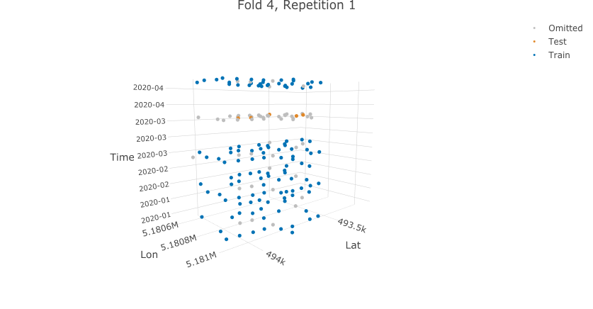

```{r setup, echo=FALSE, purl=FALSE}
# important for correct figure placement
# see https://stackoverflow.com/a/49395389/4185785
knitr::knit_hooks$set(plot = function(x, options) {
  knitr::hook_plot_tex(x, options)
})
# knitr::opts_chunk$set(cache = FALSE)
```

```{r setup-2, echo=FALSE, purl=TRUE}
# for knitr spint later
knitr::opts_chunk$set(fig.path = "./paper/figs/")
```

# Introduction

Data which includes spatial or temporal information requires special treatment in machine learning; similar to cost-sensitive, functional, multilabel, ordinal or survival datasets [@mlr3book].
In contrast to non-spatial/non-temporal data, observations inherit a natural grouping, either in space or time or in both space and time [@legendre1993].
This grouping causes observations to be autocorrelated, either in space (spatial autocorrelation (SAC)), time (temporal autocorrelation (TAC)) or both space and time (spatiotemporal autocorrelation (STAC)).
For simplicity, the acronym STAC is used as a generic term in the following discussion for all the different characteristics introduced above.

## Spatiotemporal Autocorrelation in Statistical/Machine Learning

The overarching problem is that STAC violates the assumption that the observations in the train and test datasets are independent [@hastie2001].
If this assumption is violated, the reliability of the resulting performance estimates, for example retrieved via cross-validation, is decreased.
The magnitude of this decrease is linked to the magnitude of STAC in the dataset, which cannot be determined easily.

One approach to account for the existence of STAC is to use dedicated resampling methods.
[mlr3spatiotempcv](https://mlr3spatiotempcv.mlr-org.com) provides access to the most frequently used spatiotemporal resampling methods.
The following example, which uses the [ecuador](https://mlr3spatiotempcv.mlr-org.com/reference/mlr_tasks_ecuador.html) dataset created by [Jannes Muenchow](https://scholar.google.com/citations?user=Slq94Y4AAAAJ&hl=de&authuser=1&oi=ao), showcases how a spatial dataset can be used to retrieve a bias-reduced performance estimate of a learner.

This dataset contains information on the occurrence of landslides (binary) in the Andes of Southern Ecuador.
The landslides were mapped from aerial photos taken in 2000.
The dataset is well suited to serve as an example because it is relatively small and, of course, due to the spatial nature of the observations.
Please refer to @muenchow2012 for a detailed description of the dataset.

To account for the spatial autocorrelation probably present in the landslide data, we will make use of one of the most used spatial partitioning methods, a cluster-based $k$-means grouping [@sperrorest], (`"spcv_coords"` in [mlr3spatiotempcv](https://mlr3spatiotempcv.mlr-org.com)).
This method performs a clustering in 2D space which contrasts with the commonly used random partitioning for non-spatial data.
The grouping has the effect that train and test data are more separated in space than they would be by conducting a random partitioning, thereby reducing the effect of STAC.

By contrast, when using the classical random partitioning approach with spatial data, train and test observations would be located side-by-side across the full study area (a visual example is provided further below).
This leads to a high similarity between train and test sets, resulting in "better" but over-optimistic performance estimates in every fold of a CV compared to the Spatial CV (SpCV) approach.
However, these low error rates are mainly caused due to the STAC in the observations and the lack of appropriate partitioning methods and not by the power of the fitted model.

Rephrased: the higher performance results in a non-spatial CV scenario should not be relied on or used for reporting.
The positive bias in these results is substantial and the actual performance of the model is nowhere near this result.
Results from a SpCV are not unbiased but are closer in reflecting the actual performance of the learner on unknown datasets.

## Motivation

In the last years awareness for spatiotemporal autocorrelation in ML tasks has grown [@pohjankukka2017; @roberts2017].
Subsequently, scientists started writing code to account for the issue in their studies.
With R being one of the most used languages with respect to modeling/statistics and academia in general, R packages were developed aiming to simplify the data splitting with respect to methods able to account for spatial autocorrelation [@cast, @blockCV].

This is a typical process for the R community as writing R packages has been made relatively straightforward in recent years thanks to efforts from various people/organizations such as Bioconductor, CRAN, ropensci or the tidyverse [@cran, @ropensci, @tidyverse]
Also the effort of bundling code into a defined package structure makes it easier for others to re-use it, which is a good effort towards reproducible science.

The downside which comes with this is that "island solutions" are being created, i.e. small packages which serve a particular (sometimes very niche) use case.
While the UNIX philosophy "Do one thing and do it well" [@raymond2003art] is widely known and used in the R community, R packages from different developers do often not play well with each other.
This is due to differing input and returns objects, requiring the need to pre-and postprocess objects around such R packages which provide tools for specific modeling tasks.
Also often R packages implement only an opinionated subset of methods which require users to combine multiple packages for different steps.

These points may lead to the following possible issues in practice:

- Differing syntax.
- Support for only some predictor types (e.g. numeric and factor features but no ordered factors).
- Differing return values.
- Differing namings for the same method.
- Unclear longterm maintenance.

These points add substantial overhead and/or reproducibility issues for anyone who wants to make use of the provided implementations within their studies.
\pkg{mlr3spatiotempcv} aims to provide a solution for some of the points outlined above by wrapping all spatiotemporal resampling methods available in \proglang{R} packages.
By embedding the package within the \pkg{mlr3} ecosystem, \pkg{mlr3spatiotempcv} aims to provide longterm support for spatiotemporal partitioning methods in R while making all additional benefits of the machine learning framework available to users.

In addition, \pkg{mlr3spatiotempcv} adds 2D and 3D visualization possibilities for all implemented methods.
The authors believe that the possibility for creating graphical representations of partitions is important, especially if spatio-temporal clustering or other grouping types were used to create the groups.

## The mlr3 ecosystem

The \pkg{mlr3} R package and its extensions packages form the \pkg{mlr3} machine learning ecosystem [@mlr3].
\pkg{mlr3} aims to wrap many algorithms available in R to enforce a consistent interface for such.
This adds the ability for simplified benchmarking, visualization and further model evaluation regardless of the chosen algorithm.

\pkg{mlr3spatiotempcv} complements this philosophy by aiming to apply the same standards for spatiotemporal resampling methods.

# Visualization of spatiotemporal partitions

Every partitioning method in [mlr3spatiotempcv](https://mlr3spatiotempcv.mlr-org.com) comes with generic `plot()` and `autoplot()` (\pkg{ggplot2} equivalent) method to visualize the created groups.
In a 2D space this happens via package [ggplot2](https://ggplot2.tidyverse.org) [@ggplot2] while for spatiotemporal methods 3D visualizations are created via package [plotly](https://github.com/ropensci/plotly) [@plotly].

Visualization of partitioning methods is a vital part of \pkg{mlr3spatiotempcv} as most upstream packages lack support for such.
Hence, plotting semantics are presented first because plotting will be used extensively when presenting the integrated methods.

Unless specified by the user, the coordinate reference system (CRS) defaults to EPSG code 4326 (WGS84).
This is because a lat/lon based CRS is better suited for plotting purposes than a Mercator (UTM) one due tho a more descriptive axes labeling.
Setting an appropriate CRS for the given data *during task construction* is very important.
Even though EPSG 4326 is a good fallback and often used for visualization purposes, spatial offsets of up to multiple meters may occur if the wrong CRS was passed initially.

The following example creates a spatiotemporal task from scratch.
This task is also available as a built-in task via `tsk("ecuador")`.

Because the spatial grouping of the k-means based approach (`"spcv_coords"`) (Fig. \@ref(fig:vis-spcv)) contrasts visually very well to NSpCV (random) partitioning (Fig. \@ref(fig:vis-nspcv)), this method was chosen to showcase the 2D plotting capabilities of \pkg{mlr3spatiotempcv}.

The partition plots shown in the following are also used in the case study in section \@ref(sec:case-study).

Besides the required arguments of the \pkg{mlr3} superclass `Task`, `TaskClassifST` / `TaskRegrST` classes also require the following arguments passed via a named list `extra_args`:

- `coordinate_names`: Names of the features which represent the spatial coordinates.
  This is automatically inferred when a `sf` object is passed.
- `coords_as_features`: Whether the coordinates should be used as features during modeling.
  By default coordinates are not used as predictors.
- `crs`: The coordinate reference system of the data. Valid inputs are PROJ4 strings or EPSG codes in the format `ESPG: <code>`.

```{r create task, cache=TRUE}
library(mlr3)
library(mlr3spatiotempcv)

# be less verbose
lgr::get_logger("bbotk")$set_threshold("warn")
lgr::get_logger("mlr3")$set_threshold("warn")

set.seed(42)

# equal to `tsk("ecuador")`
b = mlr3::as_data_backend(ecuador)
b$hash = "_mlr3_tasks_ecuador_" # optional
task = TaskClassifST$new(
  id = "ecuador", b, target = "slides", positive = "TRUE",
  extra_args = list(
    coordinate_names = c("x", "y"), coords_as_features = FALSE,
    crs = "+proj=utm +zone=17 +south +datum=WGS84 +units=m +no_defs") # EPSG:32717
)
```

Due to space limitations only the first two folds are plotted.

```{r vis-spcv, fig.cap="Visualization of spatial partitioning", fig.pos="ht", fig.height=6, fig.width=8, cache=TRUE}
resampling_sp = rsmp("repeated_spcv_coords", folds = 4, repeats = 2)
resampling_sp$instantiate(task)

autoplot(resampling_sp, task, fold_id = c(1:2), crs = 32717, size = 0.8) *
  ggplot2::scale_y_continuous(breaks = seq(-3.97, -4, -0.01)) *
  ggplot2::scale_x_continuous(breaks = seq(-79.06, -79.08, -0.01))
```

```{r vis-nspcv, fig.cap="Visualization of random partitioning", fig.pos="ht", fig.height=6, fig.width=8, cache=T}
resampling_nsp = rsmp("repeated_cv", folds = 4, repeats = 2)
resampling_nsp$instantiate(task)

autoplot(resampling_nsp, task, fold_id = c(1:2), crs = 32717, size = 0.8) *
  ggplot2::scale_y_continuous(breaks = seq(-3.97, -4, -0.01)) *
  ggplot2::scale_x_continuous(breaks = seq(-79.06, -79.08, -0.01))
```

# Spatiotemporal partitioning methods

At the time of writing, the following spatiotemporal resampling methods (Tab. \@ref(tab:sptcv-methods)) were available across different R packages.
This list might increase over time and it is recommended to check the homepage of \pkg{mlr3spatiotempcv} for an up-to-date list.
In Tab. \@ref(tab:sptcv-methods), the internal identifier for the respective method in \pkg{mlr3spatiotempcv} is shown in column "Notation".
Some of the methods listed are able to produce different partitioning results by setting different options, hence the actual number of available methods is higher than the one shown in Tab. \@ref(tab:sptcv-methods).

\begin{table}[h]
  \centering
  \caption[t]{Spatiotemporal resampling methods, ordered alphabetically by class name (Notation column). }
  \begingroup
  \begin{adjustbox}{angle=270}
    \begin{tabular}{lllll}
      \\
      Type                            & Name                        & R Package(s)     & mlr3 Notation  & Literature \\
      \toprule
      \multirow{3}{*}{Spatial}        & Spatial Buffering           & \pkg{blockCV}, \pkg{sperrorest}    & "spcv\_buffer", "spcv\_disc()", "spcv\_loo()" & Lit1       \\
                                      & Spatial Blocking            & \pkg{blockCV}, \pkg{sperrorest}  & "spcv\_block",
                                      "spcv\_tiles()"  & Lit1       \\
                                      & Spatial Clustering          & \pkg{sperrorest} & "spcv\_coords" & Lit1       \\
       & Leave-Location-Out & \pkg{CAST}, \pkg{sperrorest}       & "sptcv\_cstf('space\_var')", "spcv\_factor"  & Lit1       \\
      \midrule
      \multirow{2}{*}{Spatiotemporal} & Leave-Location-and-Time-Out & \pkg{CAST}       & "sptcv\_cstf"  & Lit1       \\
                                      & Spatiotemporal Clustering   & \pkg{skmeans}    & "sptcv\_cluto" & Lit1       \\
      \midrule
      Feature space                   & Environmental Blocking      & \pkg{blockCV}    & "spcv\_env"    & Lit1       \\
    \end{tabular}
  \end{adjustbox}
  \endgroup\label{tab:sptcv-methods}
\end{table}

A low-level introduction including visualization is given for every method in the following.
See section \@ref(sec:disc) for a discussion of the methods.

## Spatial buffering

The "buffering" method from the \pkg{blockCV} package is conceptually similar to a leave-one-out (LOO) cross-validation approach [@rest2014, @blockCV].
To reduce the similarity between train and test, a circular buffer around the observations representing the test set is drawn.
Within this buffer zone, all observations are removed from the training set, thereby reducing the similarity between train and test set and subsequently the influence of SAC.

By default, the method considers all points for train/test creation.
In an ecological context, this equals to the assumption of having *presence/absence* data for binary response variables.
This means all non-presence values in the response variable are assumed to be confirmed absence values.

The implementation also comes with support for *presence/background* data for binary responses.
In this scenario, only the presence values are considered validated.
All other response observations are assumed to be absent without a proof for this assumption.
When setting argument `spDataType = "PB"`, the method only considers the *presence* observations in a CV scenario.
Background data is used for training the model by default unless argument `addBG = FALSE` is set for which only *presence* values not falling within the buffer zone of the respective fold are used for model training.

Due to its similarity to a LOO CV, this method will result in as many train/test evaluations as observations are present.
In the example below, a buffer zone of 1000 m is used and the first fold shown is plotted (Fig.\@ref(fig:buffer))).

```{r buffer, fig.cap="Visualization of 'Spatial buffering' method.", out.width="50%", cache=T}
resampling_buffer = rsmp("spcv_buffer", theRange = 1000)
resampling_buffer$instantiate(task)

plot(resampling_buffer,
  size = 0.8, task = task, fold_id = 1, crs = 32717) *
  ggplot2::scale_y_continuous(breaks = seq(-3.97, -4, -0.01)) *
  ggplot2::scale_x_continuous(breaks = seq(-79.06, -79.08, -0.01))
```

<!-- TODO: Discuss issues setting a sensible range value -->

## Spatial blocking

"Spatial Blocking" (\pkg{blockCV} package) creates homogeneous blocks across the study area splitting observations into different zones [@bahn2012a, @wenger2012a].
Then, a number of zones is combined randomly following desired the number of folds.
For example, in a five-fold scenario, the method tries to combines zones to end up with partitions containing around 20\% of all observations.

The way how the blocks are created can be manifold: Supplying a numeric value in meters via argument `theRange` (named just `range` in {mlr3spatiotempcv}) will create a quadratic block pattern across the study area.
The aggregation of zones can either be random (default) (`selection = "random"`), systematic (`selection = "systematic"`) or checkerboard structure (`selection = "checkerboard"`).

### Option: selection = "random"

```{r block-random, cache = TRUE, fig.cap="Spatial blocking with option `selection = 'random'`.", out.width="50%", fig.pos="ht"}
resampling_block_random = rsmp("spcv_block", range = 1000, folds = 5)

plot(resampling_block_random,
  size = 0.8, fold_id = 1, task = task, crs = 32717,
  show_blocks = TRUE, show_labels = TRUE) *
  ggplot2::scale_y_continuous(breaks = seq(-3.97, -4, -0.01)) *
  ggplot2::scale_x_continuous(breaks = seq(-79.06, -79.08, -0.01))
```

### Option: selection = "systematic"

Here, aggregation follows the linear count from $1:n_{folds}$ from top to bottom.

```{r block-systematic, cache=TRUE, fig.cap="Spatial blocking with option `selection = 'systematic'`.", out.width="50%", fig.pos="ht"}
resampling_block_systematic = rsmp("spcv_block",
  range = 1000, folds = 5,
  selection = "systematic"
)

plot(resampling_block_systematic,
  size = 0.8, fold_id = 1, task = task, crs = 32717,
  show_blocks = TRUE, show_labels = TRUE) *
  ggplot2::scale_y_continuous(breaks = seq(-3.97, -4, -0.01)) *
  ggplot2::scale_x_continuous(breaks = seq(-79.06, -79.08, -0.01))
```

### Option: selection = "checkerboard"

This option ignores parameter `range` and always creates two partitions following a "1,2,1,2" pattern.

```{r block-checkerboard, cache=TRUE, fig.cap="Spatial blocking with option `selection = 'checkerboard'`.", out.width="40%", fig.pos="h!"}
resampling_block_checkerboard = rsmp("spcv_block",
  range = 1000, folds = 5,
  selection = "checkerboard")

plot(resampling_block_checkerboard,
  size = 0.8, fold_id = 1, task = task, crs = 32717,
  show_blocks = TRUE, show_labels = TRUE) *
  ggplot2::scale_y_continuous(breaks = seq(-3.97, -4, -0.01)) *
  ggplot2::scale_x_continuous(breaks = seq(-79.06, -79.08, -0.01))
```

\newpage

### Rectangular blocks

Alternatively, arguments `rows` and `cols` can be specified instead of `theRange`.
This allows to create rectangular blocks which honor the supplied `rows` and `cols` settings.

```{r block-rows-and-cols, cache=TRUE, fig.cap="Spatial blocking with arguments `rows` and `cols`.", out.width="40%", fig.pos="ht"}
resampling_block_rows_cols = rsmp("spcv_block",
  rows = 6, cols = 3, folds = 5
)

plot(resampling_block_rows_cols,
  size = 0.8, fold_id = 1, task = task, crs = 32717,
  show_blocks = TRUE, show_labels = TRUE) *
  ggplot2::scale_y_continuous(breaks = seq(-3.97, -4, -0.01)) *
  ggplot2::scale_x_continuous(breaks = seq(-79.06, -79.08, -0.01))
```

\newpage

## Environmental Blocking

The last method from the \pkg{blockCV} package, "environmental blocking", makes use of *k-means* clustering [@hartigan1979a] in a possibly multivariate space.
The user can specify a variable via argument `feature` which levels will be used to create clusters.
Hereby, k-means will use Euclidean distance for cluster creation.
Hence, the selected input variables should be of type numeric.
To avoid a potential bias introduced by features with high variance when selecting multiple features, all features are standardized by default.

The following example clusters by feature "distance to forest".

```{r env-1, fig.cap="Environmental blocking using a single predictor.", cache=TRUE, out.width="50%", fig.pos="ht"}
resampling_env = rsmp("spcv_env",
  features = "distdeforest", folds = 5)

plot(resampling_env,
  size = 0.8, fold_id = 1, task = task, crs = 32717,
  show_blocks = TRUE, show_labels = TRUE) *
  ggplot2::scale_y_continuous(breaks = seq(-3.97, -4, -0.01)) *
  ggplot2::scale_x_continuous(breaks = seq(-79.06, -79.08, -0.01))
```

It is also possible to cluster by multiple features:

```{r env-2, fig.cap="Environmental blocking using multiple predictors.", cache=TRUE, out.width="50%", fig.pos="ht"}
resampling_env_multi = rsmp("spcv_env",
  features = c("distdeforest", "slope"), folds = 5)

plot(resampling_env_multi,
  size = 0.8, fold_id = 1, task = task, crs = 32717,
  show_blocks = TRUE, show_labels = TRUE) *
  ggplot2::scale_y_continuous(breaks = seq(-3.97, -4, -0.01)) *
  ggplot2::scale_x_continuous(breaks = seq(-79.06, -79.08, -0.01))
```

## Spatial CV

The "Spatial CV" method after [@sperrorest] and implemented in package \pkg{sperrorest} is similar to method "environmental blocking" in that it also uses *k-means* clustering for fold creation.
However, it does not make use of arbitrary features but uses the coordinates of all observations to create clusters in the spatial domain.
This is what lead to the naming of `spcv_coords` in \pkg{mlr3spatiotempcv}.

```{r coords, fig.cap="Method 'Spatial CV' showing a k-means clustering approach based on coordinates.", cache=TRUE, out.width="50%", fig.pos="ht"}
resampling_coords = rsmp("spcv_coords", folds = 5)$instantiate(task)

plot(resampling_coords,
  size = 0.8, fold_id = 1, task = task, crs = 32717) *
  ggplot2::scale_y_continuous(breaks = seq(-3.97, -4, -0.01)) *
  ggplot2::scale_x_continuous(breaks = seq(-79.06, -79.08, -0.01))
```

## CreateSpacetimeFolds (Cstf)

Leave-Location-and-Time-Out from packge \pkg{CAST} is a spatiotemporal resampling method [@meyer2018a].
It requires both a spatial and a temporal variable which are used to to separate observations in a multi-dimensional space.
It comes with satellite methods named "Leave-time-out" (LTO) and "Leave-location-out" (LLO) which only operatre in a two-dimensional space.

In this example the `cookfarm` dataset is used because it contains a temporal variable ("Date") which is not present in dataset `ecuador`.

Two visualization types are supported: a two-dimensional and a three-dimensional method which can be selected via the logical argument `plot3d`.
The 3D visualization has been implemented via \pkg{plotly}.
Because a dynamic image cannot be included in this manuscript, a static version, which can be generated by setting `static_image = TRUE`, is shown.

In \pkg{mlr3spatiotempcv} the method is named `"sptcv_cstf"` because the underlying upstream implementation in package \pkg{CAST} is named `CreateSpacetimeFolds()`.

### Leave-Time-Out (LTO)

To better showcase the partitioning of the "Leave-Time-Out" (LTO) method, the temporal variable `Date` was adjusted in this example.

The following code uses the `cookfarm` dataset as the base, modifies to the `Date` variable to contain five unique levels and then creates a spatiotemporal regression task in \pkg{mlr3spatiotempcv} (Fig.\@ref(fig:lto)).

```{r, results='hide', cache=TRUE}
data = cookfarm_sample
data$Date = rep(c(
  "2020-01-01", "2020-02-01", "2020-03-01", "2020-04-01",
  "2020-05-01"), times = 1, each = 100)
b = mlr3::as_data_backend(data)
b$hash = "_mlr3_tasks_cookfarm_"
task_spt = TaskRegrST$new(
  id = "cookfarm", b, target = "PHIHOX",
  extra_args = list(
    coordinate_names = c("x", "y"), coords_as_features = FALSE,
    crs = 26911)
)

resampling_cstf_time = rsmp("sptcv_cstf", folds = 5, time_var = "Date")
resampling_cstf_time$instantiate(task_spt)

plot(resampling_cstf_time,
  fold_id = 5, task = task_spt, crs = 32717, plot3D = TRUE
)
```

```{r lto, echo=FALSE, out.width="90%", fig.cap="Three-dimensional visualization of method `sptcv\\_cstf` and sub-method Leave-Time-Out (LTO). To support showcasing the temporal grouping, five folds and five temporal levels in variable `Date` were used in this example.", fig.pos="ht"}
knitr::include_graphics("lto.png")
```

### Leave-Location-Out (LLO)

Method "Leave-Location-Out" (LLO) works similar to "Leave-Time-Out" (LTO) in that it operates in a two-dimensional space.
Here, specific locations are left out for forming the partitions while the temporal information is ignored (Fig.\@ref(fig:llo)).

```{r cache=TRUE, results='hide'}
resampling_cstf_loc = rsmp("sptcv_cstf", folds = 5, space_var = "SOURCEID")
resampling_cstf_loc$instantiate(task_spt)

plot(resampling_cstf_loc,
  fold_id = 5, task = task_spt, crs = 32717, plot3D = TRUE)
```

```{r llo, echo=FALSE, out.width="90%", fig.cap="Three-dimensional visualization of method 'sptcv\\_cstf' and sub-method 'Leave-Location-Out' (LLO). To support showcasing the spatial grouping, the viewing angle has been adjusted to a view from top. Points are stacked by temporal levels and only points from the same location are chosen to form a partition.", fig.pos="ht"}
knitr::include_graphics("llo.png")
```

### Leave-Location-and-Time-Out (LLTO)

The "Leave-Location-and-Time-Out" (LLTO) method combines both "Leave-Time-Out" (LTO) and "Leave-Location-Out" (LLO).
It creates partitions that operate on spatiotemporal clusters to reduce both spatial and temporal autocorrelation.
To achieve this, observations are omitted and only a subset is used.
In the special scenario with five temporal levels and five folds, the train/test split happens only at one temporal level (Fig.\@ref(fig:llto)).

```{r cache=TRUE, results='hide'}
resampling_cstf_time_loc = rsmp("sptcv_cstf",
  folds = 5,
  space_var = "SOURCEID", time_var = "Date")
resampling_cstf_time_loc$instantiate(task_spt)

plot(resampling_cstf_time_loc,
  fold_id = 4, task = task_spt, crs = 32717, plot3D = TRUE,
  show_omitted = TRUE)
```

```{r llto, echo=FALSE, out.width="90%", fig.cap="Three-dimensional visualization of method 'sptcv\\_cstf' and sub-method 'Leave-Location-And-Time-Out' (LLTO). The grey points show the points omitted by this method.", cache=TRUE, fig.pos="ht"}

```

## Spatiotemporal Clustering (Cluto)

The "CLUTO" clustering algorithm by George Karypis is said to be an application "for clustering of low- and high-dimensional datasets and for analyzing the characteristics of the various clusters" [@cluto].

The method can generally be used in {mlr3spatiotempcv} if users cope with the copyright statement of the tool, which restricts usage to non-profit organizations and US government agencies only, and make the application binary available locally.

These restrictions in combination with

- the requirement of a local binary which needs to be downloaded externally and added to a user's system path
- the absent of updates since the year 2007
- a http-only website
- no response from the copyright holder after asking for the current status of the project

led to the decision to not explain and showcase this method in greater detail in this manuscript.
Users are encouraged to visit the help page of the package for this method (`?ResamplingSptCVCluto`) for more information.

# Case study: Comparing spatial and non-spatial resampling {#sec:case-study}

To show the effect of spatial autocorrelation on performance estimates in cross-validation, a spatial and non-spatial CV using method `"spatial_coords"` will be shown in the following.

The performance of a simple classification tree (`"classif.ranger"`) is evaluated on a repeated cross-validation (`"repeated_cv"`) with four folds and two repetitions.
In reality, more fold (between five and ten) and a higher number of repetitions should be used.
The chosen evaluation measure is the "Area Under the ROC Curve" (`"classif.auc"`) which is a common evaluation measure for binary responses.
The CV will be executed twice with the only difference being the use of a spatial resampling object (initialized with `rsmp("repeated_spcv_coords"`) instead of a non-spatial one (`rsmp("repeated_cv"`).

## Data preparation

At first all necessary R packages are loaded and a lower verbosity is set to keep the output tidy.
Also a seed is set for deterministic execution.

Next the \pkg{mlr3spatiotempcv} built-in task `"ecuador"` is loaded via `tsk()`.

Next, the random forest learner (`lrn("classif.ranger")`) is initialized with default hyperparameters and the prediction type set to `"probability"` due to the binary response variable.
A set of commonly used learners is available in \pkg{mlr3learners} [@mlr3learners], including the random forest implementation after @ranger.

```{r prepare, cache=TRUE}
library("mlr3")
library("mlr3spatiotempcv")
library("mlr3learners")

task = tsk("ecuador")

learner = lrn("classif.ranger", predict_type = "prob")
```

## Non-spatial cross-validation

A four-fold, two times repeated non-spatial resampling object is constructed and instantiated via method `$instantiate()`.
Next, the created resampling object `resampling_nsp` is passed to function `resample()` together with the Task and Learner created earlier to execute the cross-validation.

The results from the CV are then aggregated using the measure `"classif.auc"`, which is the package notation for the Area Under the Receivers Operating Curve (AUROC) measure.

```{r rr-nspcv, cache=TRUE, cache.lazy = FALSE}
resampling_nsp = rsmp("repeated_cv", folds = 4, repeats = 2)
resampling_nsp$instantiate(task)
rr_nsp = resample(
  task = task, learner = learner,
  resampling = resampling_nsp
)

rr_nsp$aggregate(measures = msr("classif.auc"))
```

## Spatial cross-validation

The same approach as for non-spatial resampling is used for spatial resampling, expect replacing method `"repeated_cv"` by `"repeated_spcv_coords"`.

```{r rr-spcv, cache=TRUE, cache.lazy = FALSE}
resampling_sp = rsmp("repeated_spcv_coords", folds = 4, repeats = 2)
resampling_sp$instantiate(task)
rr_sp = resample(
  task = task, learner = learner,
  resampling = resampling_sp
)

rr_sp$aggregate(measures = msr("classif.auc"))
```

## Summary

The resulting AUC valiue of 0.77 using Non-Spatial Cross-Validation (NSpCV) is around 0.15 better compared to the Spatial Cross-Validation (SpCV) value of 0.61.
The better performance score results from over-optimism in the estimation with NSpCV.
The actual predictive performance on new data is much more realistically reflected by the performance estimated via SpCV.
The magnitude of this difference is variable as it depends on the dataset, the magnitude of STAC and the learner itself.
Algorithms with a higher tendency of overfitting to the training set will have a large spread in such scenarios.

The respective folds of the resamplings used in this example are shown in Fig. \@ref(fig:vis-spcv) and Fig. \@ref(fig:vis-nspcv).

# Discussion {#sec:disc}

## Choosing a resampling method

While in the example the `"spcv_coords"` method was used, this should not imply that this method is the best or only method suitable for this example task.
Even though this method is frequently used, it was mainly chosen because of it's clear visual grouping differences when comparing spatial to random partitioning.

In fact, most often multiple spatial partitioning methods can be used for a dataset.
It is recommended (required) that users familiarize themselves with multiple methods and decide which method to choose based on the specific characteristics of the dataset at hand.
There are various variables influencing the partitioning method choice for an environmental dataset:

- Do natural groupings exists in the data?
- How dense are the observations scattered both in space and time?
- Are the predictor variables known to be highly affected by spatiotemporal autocorrelation by nature?

Based on these criteria users must choose a matching partitioning method that is either more restrictive (by discarding observations for fold creation) or more liberal (by using all observations and eventually ignoring natural grouping patterns).
For almost all methods implemented in \pkg{mlr3spatiotempcv}, there is a scientific publication describing the strengths and weaknesses of the respective approach (either linked in the help file of the package or its respective upstream packages).

In the example above, a cross-validation without hyperparameter tuning was shown.
In practice most often a nested CV is desired.
In this case it is recommended to use the same spatial partitioning method for the inner loop (= tuning level).
See @schratz2019 for more details and chapter 11 of [Geocomputation with R](https://geocompr.robinlovelace.net/spatial-cv.html) [@lovelace2019].

## Comparing spatio-temporal resampling methods

<!-- high autocor on the border of test sets -->
<!-- sptcv LLTO: discards many observations -->
All methods which make use of all variables in the dataset suffer from the problem that on the border between train and test sets, both in the spatial and temporal domain, autocorrelation is quite high.
Only methods that omit some observations (`"spcv_buffer"`, `"sptcv_cstf"` with both `space_var` and `time_var` set) are able to reduce this problem.
However, these then suffer from the fact of potentially not being able to properly represent the dataset because only a subset of observations is used.

<!-- sptcv LLO & LTO: requires additional variable to specify groupings -->
Methods `"spcv_cstf"` (with only one of `space_var` or `time_var` set) require a variable in the dataset which should be used for grouping.
The specification of such is not always easy because the selection of such a variable also implies that the selected groups inherit substantial autorcorrelation and differ substantially from other groups.
Also, if the variable contains too many groups, the difference within train/test splits may become undesirably high and tend towards a LOO CV.

<!-- only some methods are suited for repeated execution -->
<!-- spcv_coords: limited variance due to limited k-means possibilties -->
For repeated executions of method `spcv_coords`, the variance between repetitions could be quite small due to the limited possibilities of different `k-means` clusters on the same dataset.
This applies even more to `"spcv_block"` with options `selection = "systematic"` and `selection = "checkerboard"` as the fold assignments are the same in each repetition.
Only methods with a random component (e.g. `"spcv_coords"` or `"spcv_block"` with option `selction = "random"`) may be suited for using multiple repetitions.

<!-- spcv buffer: discards observations, LOO very expensive -->
Method `"spcv_buffer"` makes use of the removal of observations to reduce the influence of spatial autocorrelation between train and test set.
This might be pretty effective in reducing autocorrelation but also requires to discard many variables and comes with the downsides of LOO-CV: many model fits which can be computationally very demanding and a high variance due to the high similarity of training datasets [@blockCV].

<!-- spcv coords: mention generic name -->
In @sperrorest, which is commonly used as the main reference for this k-means based spatial clustering approach, the method was not assigned a unique name.
This brings potential confusion for users and the community as the term "spatial CV" is used a generic one for the idea of accounting for spatial autocorrelation for spatial datasets.
Hence, in \pkg{mlr3spatiotempcv} this method was named `"spcv_coords"`, making use of the fact that the spatial coordinates are used for a cluster-based partition creation.

<!-- env block: hard to decide which variable to use for clustering -->
<!-- env block: more than one variable may lead to unforeseeable results -->
Method `"spcv_env"` is complicated in that it requires the user to limit the clustering to (a) specific variable(s).
This implies that only this/these variable(s) suffer from autocorrelation and others can be ignored.
However, the influence of a single variable is hard to estimate and the same applies for estimating the influence of the non-accounted variables which might add substantial bias to the CV.

# Summary and outlook

<!-- missing: Guidelines how to choose a resampling method -->
While various spatio-temporal resampling methods exists nowadays to account for spatio-temporal autocorrelation in modeling, there is still lots of uncertainties which method should be used for which dataset.
The answer to this questions is not trivial and needs more research.
One option could be to propose a checklist of dataset characteristics which would make a dataset more suitable for specific methods that could help users making an appropriate and objective decision.

<!-- missing: non-LOO method with buffer support -->
Also no methods yet exists that makes use of a buffer zone with blocking or clustering, bridging the gap between buffered LOO-CV and fold-based non-buffer methods (`"spcv_coords"` and `"spcv_block"`).

We believe that making resampling methods available to widely used modeling frameworks is more benefitial than implementing such methods standalone in an R package.
The latter often require special structured objects as inputs and cannot directly be re-used in susequent modeling steps of user workflows.
This is not an issue specific to spatio-temporal resampling methods but a general philosophy of the authors.

Spatio-temporal cross-validation is still not yet a paradigm that is completely established in scientfic workflows even though it is discussed intensively for more than a decade now.
Making most available methods easily accessible to users is an important step to foster the acceptance of such in the community and lead to less biased cross-validation results in environmental and ecological studies.

```{r echo=FALSE}
sessionInfo()
```

# References

