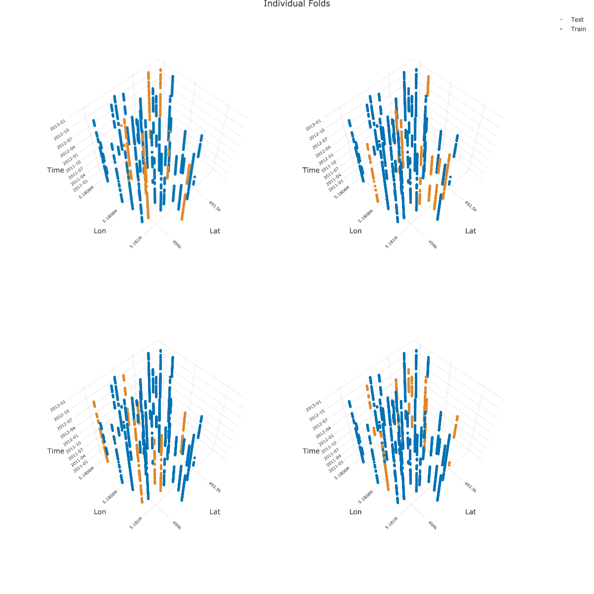

```{r, include = FALSE}
knitr::opts_chunk$set(
  collapse = TRUE,
  comment = "#>"
)
```

{mlr3spatiotempcv} makes use of {plotly} to create the 3D plots for visualizing spatiotemporal folds created via the CLUTO algorithm.
Arranging multiple 3D plots in {plotly} is done via [3D subplots](https://plotly.com/r/3d-subplots/).

Unfortunately, {plotly}'s subplot implementation is not dynamic.
This means that multiple "scene" objects need to be specified in `plotly::layout()` to determine the coordinates of the respective subplot.
Depending on the number of chosen folds by the user in `autoplot()`, a different number of scenes with different coordinates needs to be given to align the plots properly.

Hence, manual action is needed to create a properly aligned grid of 3D plots.

Below is an example how to create a 2x2 grid showing four folds as 3D subplots.
It makes use of the returned 3D plotly objects which are returned in a list by `autoplot()`:

```{r, fig.align='center', eval=FALSE}
library(mlr3)
library(mlr3spatiotempcv)
task_st = tsk("cookfarm")
resampling = rsmp("sptcv_cstf",
  folds = 5, time_var = "Date",
  space_var = "SOURCEID")
resampling$instantiate(task_st)

pl = autoplot(resampling, task_st, c(1, 2, 3, 4),
  crs = 4326, point_size = 3, axis_label_fontsize = 10)

# Warnings can be ignored
pl_subplot = plotly::subplot(pl)

plotly::layout(pl_subplot,
  title = "Individual Folds",
  scene = list(
    domain = list(x = c(0, 0.5), y = c(0.5, 1)),
    aspectmode = "cube",
    camera = list(eye = list(z = 2.5))
  ),
  scene2 = list(
    domain = list(x = c(0.5, 1), y = c(0.5, 1)),
    aspectmode = "cube",
    camera = list(eye = list(z = 2.5))
  ),
  scene3 = list(
    domain = list(x = c(0, 0.5), y = c(0, 0.5)),
    aspectmode = "cube",
    camera = list(eye = list(z = 2.5))
  ),
  scene4 = list(
    domain = list(x = c(0.5, 1), y = c(0, 0.5)),
    aspectmode = "cube",
    camera = list(eye = list(z = 2.5))
  )
)
```

```{r, echo=FALSE, fig.align='center', fig.align='center'}
# plotly::orca(foo, "man/figures/sptcv_cstf_multiplot.png", width = 1200, height = 1200)

```

Note: The image shown above is a static version created with `plotly::orca()`.

Subplot titles can unfortunately not created dynamically.
However, there is a manual workaround via [annotations](https://plotly.com/r/reference/#layout-annotations) show in this [RPubs post](https://rpubs.com/bcd/subplot-titles).
